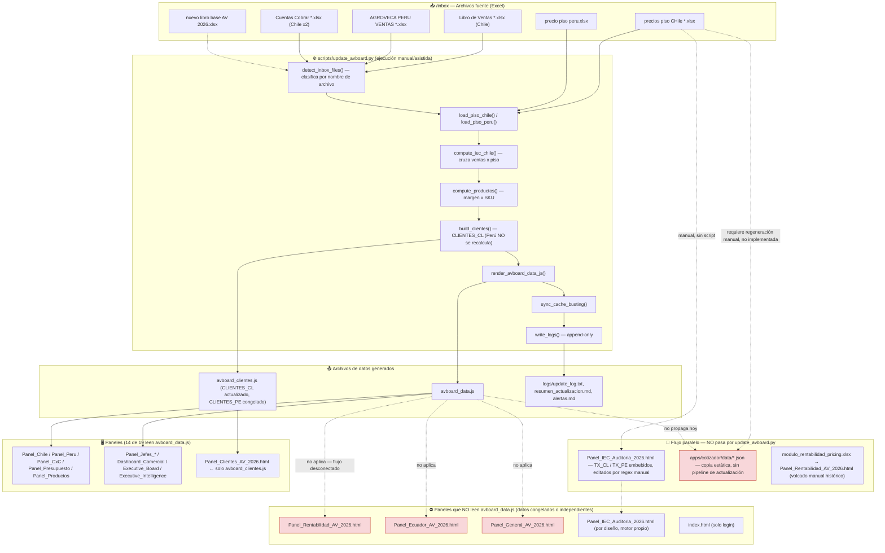
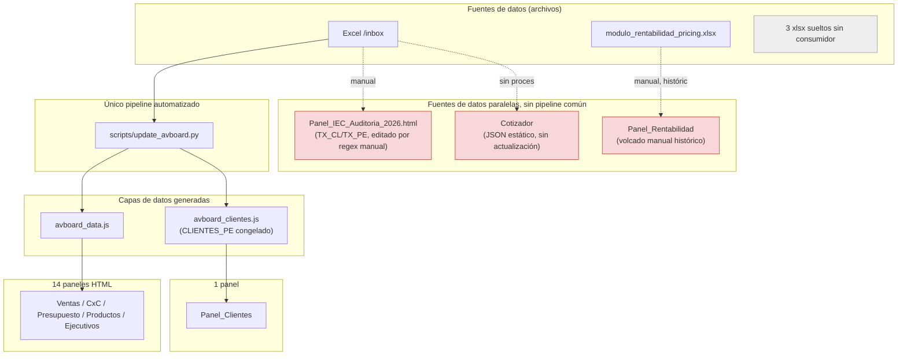
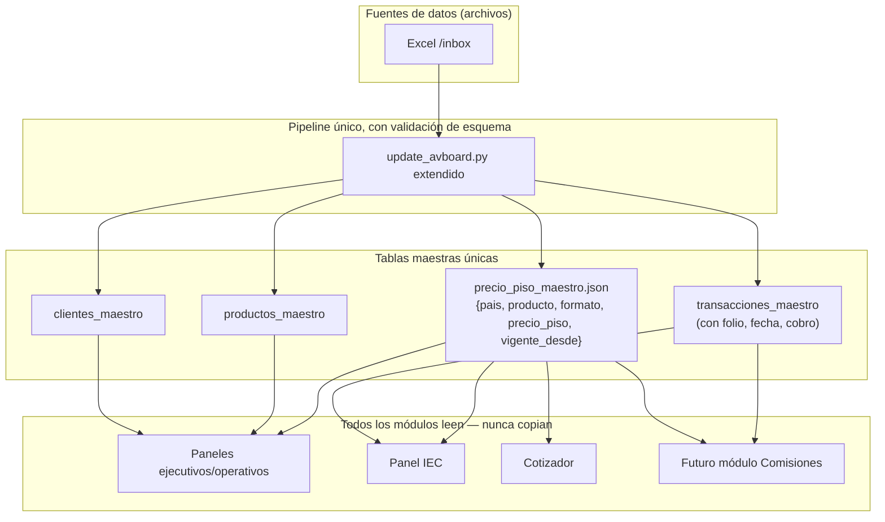

# Arquitectura Actual — AV LATAM Board

**Agroveca Grupo LATAM · Auditoría técnica y funcional**
Fecha de auditoría: 2026-07-12 · Auditor: Claude (Anthropic), modo Cowork · Alcance: solo lectura, sin modificaciones al proyecto

---

## Cómo leer este documento

Cada afirmación está marcada como uno de estos tres tipos:

- **[HECHO]** — verificado directamente leyendo código, datos o logs del repositorio en la fecha de esta auditoría. Incluye ruta exacta y línea.
- **[INFERENCIA]** — conclusión razonable a partir de hechos verificados, pero no confirmada explícitamente en ningún archivo (por ejemplo, "probablemente esto ocurre porque...").
- **[NO DETERMINABLE]** — no se pudo confirmar con la información disponible en el repositorio. Se indica qué falta para poder confirmarlo.

No se inventó ningún dato, cifra o comportamiento. Todo lo citado proviene de archivos existentes en `/Users/javieralmeida/Documents/GitHub/av-latam-board/` al momento de la auditoría.

---

## 1. Resumen Ejecutivo

**[HECHO]** AV LATAM Board es una plataforma de inteligencia comercial construida enteramente con archivos estáticos: HTML, CSS y JavaScript. No existe servidor de aplicación, no existe base de datos y no existe API. Los 19 paneles HTML que viven en la raíz del repositorio (`Dashboard_Comercial_AV_Latam_2026.html`, `Panel_Chile_AV_2026.html`, `Panel_Clientes_AV_2026.html`, etc.) se abren directamente en el navegador y leen sus datos desde dos archivos JavaScript generados: `avboard_data.js` (61.637 bytes) y `avboard_clientes.js` (169.852 bytes). Estos dos archivos no son bases de datos — son literales JavaScript (`var AVBOARD = (function(){...})();`, `const CLIENTES_CL = [...]`) que quedan embebidos en memoria del navegador cuando el usuario abre un panel.

**[HECHO]** La actualización de estos datos ocurre mediante un pipeline Python: `scripts/update_avboard.py` (2.085 líneas). Este script lee archivos Excel colocados en `/inbox` (identificados por patrón de nombre de archivo, no por su contenido), procesa ventas, cuentas por cobrar y precios piso con pandas, y **regenera por completo** el contenido de `avboard_data.js` y `avboard_clientes.js` mediante construcción de texto (string templating), sobrescribiendo el archivo anterior. No hay comandos `git` dentro del script — el commit y push a GitHub son un paso manual posterior que debe ejecutar una persona (Claude, en la práctica, siguiendo las instrucciones de este proyecto).

**[HECHO]** El "piso de precios" (precio piso) —la política comercial más crítica del negocio— proviene de dos archivos Excel independientes (`precios piso CHile .xlsx` para Chile, `precio piso peru.xlsx` para Perú), separados de los archivos de ventas. El pipeline cruza cada línea de venta con la tabla de precio piso vigente para calcular el IEC (Índice de Eficiencia Comercial: % de venta facturada igual o sobre el piso).

**Por qué un cambio en un archivo maestro podría no reflejarse automáticamente en toda la plataforma — las tres causas raíz encontradas:**

1. **No todos los paneles leen `avboard_data.js`.** De los 19 archivos HTML en la raíz, 5 no cargan este archivo: `Panel_Rentabilidad_AV_2026.html`, `Panel_Ecuador_AV_2026.html`, `Panel_General_AV_2026.html`, `Panel_IEC_Auditoria_2026.html` e `index.html` **[HECHO, verificado por grep en los 19 archivos, ver sección 2]**. Los tres primeros muestran cifras congeladas en el HTML; Panel_IEC_Auditoria tiene su propio motor de datos independiente (ver punto 3).
2. **El módulo Cotizador tiene su propia copia estática del catálogo de precios**, generada una única vez durante su desarrollo (`apps/cotizador/data/productos_chile.json`, `productos_peru.json`), y **ningún proceso automático la actualiza**. El pipeline `update_avboard.py` no contiene ninguna referencia a "cotizador" **[HECHO, 0 coincidencias al buscar "cotizador" en el script]**. Un cambio de precio piso en el Excel de origen se reflejará en `avboard_data.js` pero no llegará al Cotizador hasta que alguien regenere manualmente esos JSON.
3. **`Panel_IEC_Auditoria_2026.html` no usa `avboard_data.js` en absoluto** — tiene sus propios arreglos `TX_CL`/`TX_PE` (transacciones individuales, con folio y factura) embebidos directamente dentro del propio archivo HTML, actualizados con un script Python que hace *find-and-replace* con expresiones regulares sobre el HTML. Es, por diseño, una fuente de datos paralela.

Además, el archivo `avboard_data.js` **no se edita línea por línea** — se regenera completo en cada corte. Esto significa que cualquier edición manual hecha directamente sobre `avboard_data.js` (fuera del pipeline) se perderá en la siguiente ejecución de `update_avboard.py`.

**Riesgo de arquitectura más importante para Gerencia General:** hoy no existe una única tabla maestra de "precio piso" que todos los módulos consuman en vivo. Existen al menos tres representaciones del precio piso que pueden desincronizarse entre sí: (a) el Excel de origen en `/inbox`, (b) el campo `piso` dentro de `avboard_data.js`, y (c) el catálogo estático del Cotizador. Ver sección 6 para el detalle completo y una arquitectura recomendada de tabla única.

---

## 2. Inventario de Módulos

Para cada módulo: objetivo, archivos, datos de entrada/salida, dependencias y forma de actualización.

### 2.1 Inbox (ingesta)

- **Objetivo:** recibir los archivos fuente que el equipo comercial/finanzas sube periódicamente.
- **Archivos que usa:** carpeta `/inbox/` — **[HECHO]** 64 archivos `.xlsx` presentes al momento de esta auditoría, más un `.DS_Store`.
- **Datos de entrada:** Excel de ventas Chile (`Libro de Ventas DD-MM-YYYY.xlsx`), ventas Perú (`AGROVECA PERU - VENTAS AL DD.MM.YYYY.xlsx`), cuentas por cobrar Chile en 2 entidades (`Cuentas Cobrar Agrocomercial DD-MM.xlsx`, `Cuentas Cobrar Agroveca DD-MM.xlsx`), precio piso Chile (`precios piso CHile .xlsx`, sin fecha en el nombre), precio piso Perú (`precio piso peru.xlsx`, sin fecha en el nombre), presupuesto (`nuevo libro base AV 2026.xlsx`). También hay archivos legado/ignorados (`VENTAS FACTURADAS AL...xlsx`, `Ventas al DD-MM.xlsx`, un `.eml`, un `.rtf`) que el pipeline no reconoce por patrón.
- **Datos que genera:** ninguno — es solo almacenamiento de entrada.
- **Dependencias:** ninguna (es el punto de partida del flujo).
- **Actualización:** manual — el usuario copia archivos nuevos a esta carpeta. **[HECHO, confirmado en `project_instructions`: "El usuario solo cargará archivos en /inbox"]**.
- **Riesgo detectado:** los archivos de precio piso no llevan fecha en el nombre (`detect_inbox_files()`, `scripts/update_avboard.py:157`). Si llegara más de una versión a la vez, no hay lógica para desambiguar cuál es la más reciente.

### 2.2 Pipeline ETL (`scripts/update_avboard.py`)

- **Objetivo:** transformar los Excel del inbox en los dos archivos de datos JavaScript que consumen los paneles, y sincronizar el cache-busting de todos los HTML.
- **Archivos que usa:** `/inbox/*.xlsx`, `scripts/ppto_libro_base.py` (importado para presupuesto).
- **Datos de entrada:** los Excel descritos en 2.1.
- **Datos que genera:** `avboard_data.js`, `avboard_clientes.js`, entradas en `logs/update_log.txt`, `logs/resumen_actualizacion.md`, `logs/alertas.md`, y actualiza el parámetro `?v=` en el `<script src="avboard_data.js?v=...">` de cada panel (`sync_cache_busting()`, línea 1753).
- **Dependencias:** pandas, openpyxl (lectura de Excel); `node` opcional para validar sintaxis JS al final (`validate_js()`, línea 1881; si `node` no está disponible, degrada sin bloquear).
- **Forma de actualización:** manual/asistida — se ejecuta como script Python (`main()`, línea 1943; punto de entrada `if __name__ == '__main__':`, línea 2084) cuando llegan archivos nuevos al inbox. No hay cron, no hay trigger automático detectado.
- **Funciones clave (todas verificadas por línea):**
  - `detect_inbox_files()` — línea 157: clasifica archivos del inbox solo por patrón de nombre (glob), no inspecciona contenido.
  - `load_piso_chile(piso_path)` — línea 708: lee hoja `'Pricing Piso Chile'`, encabezado en fila 4; prioriza columna "NUEVO PRECIO"/"PROPUESTO" sobre "PRECIO PISO...CALCULADO" (líneas 739-741).
  - `compute_iec_chile(df_ventas, piso)` — línea 757: calcula `cumple = 1 if pv >= pp else 0`.
  - `compute_productos_chile(df_ventas, piso)` — línea 856 — y `compute_productos_peru(df_sku, piso_pe)` — línea 1032 —, unificadas en `compute_productos(...)` — línea 1079: calculan margen usando `costo_unidad` de la misma tabla de piso.
  - `load_piso_peru(piso_path)` — línea 962: hoja `'Pricing Piso Peru'`, basada en tramos de volumen (1/20/200/1000 L), con `nearest_tier_pe()` (líneas 953-959) haciendo *matching* por distancia logarítmica — el propio código lo documenta como "best-effort".
  - `render_avboard_data_js(...)` — línea 1145: construye el texto completo de `avboard_data.js`.
  - `build_clientes(...)` — línea 1480: construye `CLIENTES_CL`. `CLIENTES_PE` siempre se devuelve preservando el valor existente (líneas 1631-1639), es decir, **el script no recalcula clientes de Perú en cada corte**.
  - `extract_peru_cxc_static()` — línea 1912: diccionario **enteramente escrito a mano en el código**, con fecha fija `"10/05/2026"` — no se lee de ningún Excel.
  - `sync_cache_busting()` — línea 1753.
  - `write_logs(summary)` — línea 1791: escribe en modo *append* (agregar, nunca sobrescribir) a los 3 archivos de log.

### 2.3 `scripts/ppto_libro_base.py`

- **Objetivo:** leer el presupuesto oficial desde el "libro base".
- **Archivos que usa:** `inbox/nuevo libro base AV 2026.xlsx`, hoja `"Presupuesto Pais"`, vía `openpyxl`.
- **Datos que genera:** valores de presupuesto mensual/anual por país, expuestos a través de `get_ppto_all()` (línea 270).
- **Dependencias:** es importado por `scripts/update_avboard.py:70`.
- **Detalle relevante:** contiene constantes de respaldo hardcodeadas `PPTO_MENSUAL_CL_LEGACY` / `PPTO_MENSUAL_PE_LEGACY` (líneas 31-66) que se usan si el Excel no puede leerse.
- **Actualización:** automática dentro del flujo del pipeline, siempre que `nuevo libro base AV 2026.xlsx` esté en `/inbox`.

### 2.4 Ventas (Chile / Perú)

- **Objetivo:** mostrar ventas por país, mes, RTC (vendedor) y comparación contra presupuesto.
- **Paneles:** `Panel_Chile_AV_2026.html`, `Panel_Peru_AV_2026.html`.
- **Datos de entrada:** `avboard_data.js` (secciones `chile_ventas`, `peru_ventas`).
- **Datos que genera:** ninguno — son de solo lectura/presentación.
- **Dependencias:** `avboard_data.js` con cache-busting `?v=20260701` **[HECHO, verificado en los 19 HTML]**.
- **Actualización:** automática al abrir el panel, siempre que `avboard_data.js` esté al día; el dato en sí requiere que el pipeline haya corrido.

### 2.5 Presupuesto

- **Objetivo:** seguimiento mensual de presupuesto Chile y Perú.
- **Panel:** `Panel_Presupuesto_AV_2026.html`.
- **Datos de entrada:** `avboard_data.js`.
- **Bug confirmado [HECHO]:** el tag `<script src="https://cdn.jsdelivr.net/npm/chart.js@4.4.0/dist/chart.umd.min.js">` (línea 18 del archivo) **no se cierra** hasta la línea 146. Por especificación HTML, un `<script>` con atributo `src` ignora cualquier contenido inline que quede dentro de la etiqueta — por lo tanto, todo el bloque de datos `CH_RTC_DATA` / `CH_MES_DATA` / `PE_RTC_DATA` escrito entre esas líneas nunca se ejecuta en ningún navegador. Efecto verificado y documentado en `logs/alertas.md` (entrada `2026-06-25 05:19`): los selectores de curva por RTC (botones Caroca/Laratro/Encina/Velásquez/Veverka en Chile, y sus equivalentes en Perú) no responden al hacer clic — lanzan `TypeError` silencioso en consola. El impacto visual en la carga inicial es nulo porque los 4 gráficos ya reciben datos correctos de `avboard_data.js` antes de llegar a ese bloque roto; el problema solo afecta la interactividad de esos selectores. **No corregido** (fuera del alcance de esta auditoría, que es solo diagnóstico).
- **Riesgo adicional documentado:** las tablas de presupuesto por RTC en Perú suman al total *legacy* (USD 1.137.034) mientras el total general fue parchado a mano a la cifra correcta del Libro Base (USD 1.380.015) — inconsistencia interna en la misma tabla (`logs/alertas.md`, `2026-06-25 05:19`, hallazgo 2). Se sospecha el mismo patrón en Chile, sin confirmar.

### 2.6 Forecast

**[NO DETERMINABLE]** No se encontró ningún panel, hoja de datos ni sección de `avboard_data.js` con esta etiqueta. No existe evidencia de un módulo de Forecast implementado hoy. Si existe una intención de negocio para este módulo, no está reflejada en el código actual.

### 2.7 Pipeline (comercial, embudo de ventas)

**[NO DETERMINABLE]** Igual que Forecast: no se encontró ningún archivo, sección de datos ni panel relacionado con seguimiento de oportunidades/embudo comercial. No existe hoy en la plataforma.

### 2.8 Cobranza (Cuentas por Cobrar — CxC)

- **Objetivo:** monitorear cartera vencida por cliente, entidad y país.
- **Panel:** `Panel_CxC_AV_Latam_2026.html`.
- **Datos de entrada:** `avboard_data.js` (`chile_cxc`, `peru_cxc`), consolidado por Chile en 2 entidades (Agrocomercial + Agroveca) y en Perú (**[HECHO]** el CxC Perú, sin embargo, está **completamente hardcodeado** en `extract_peru_cxc_static()`, línea 1912, con fecha fija `"10/05/2026"` — no proviene de ningún Excel de `/inbox` al momento de esta auditoría, pese a que el `docs/AVBOARD_MASTER_ARCHITECTURE.md` (línea 25) documenta un archivo `AGROVECA CxC *.xlsx` para Perú que **no se encontró** en el inbox actual).
- **Datos que genera:** también alimenta `logs/alertas.md` con la tabla de "Alertas Activas" (clientes con mora >90 días), regenerada en cada corte.
- **Actualización:** automática para Chile (sigue el pipeline); estática/manual para Perú.

### 2.9 Clientes

- **Objetivo:** CRM ejecutivo por cliente — score, IEC, CxC, evolución mensual, recomendaciones automáticas.
- **Panel:** `Panel_Clientes_AV_2026.html`.
- **Datos de entrada:** `avboard_clientes.js` — **[HECHO, verificado por grep]** este panel es el único que carga `avboard_clientes.js` y **no** carga `avboard_data.js` directamente.
- **Datos que genera:** `CLIENTES_CL` (Chile) y `CLIENTES_PE` (Perú), con score compuesto documentado en `docs/AVBOARD_BUSINESS_RULES.md` sección 4 (IEC 30% + Frecuencia 25% + CxC 25% + Diversificación 10% + Volumen 10%).
- **Dato relevante:** `build_clientes()` (línea 1480) recalcula `CLIENTES_CL` en cada corte, pero **preserva `CLIENTES_PE` sin recalcular** (líneas 1631-1639) — es decir, los clientes de Perú no se actualizan automáticamente con el pipeline.
- **Bug residual [HECHO]:** dentro de `build_clientes()`, las líneas 1515-1516 usan índices fijos `MESES_FULL[4]` / `MESES_FULL[3]` (Mayo/Abril) para calcular la tendencia del cliente ("creciente"/"estable"/"decreciente"), en lugar de detectar dinámicamente los dos últimos meses del corte vigente como hace el resto del pipeline. Esto significa que, a medida que avancen los meses (junio, julio...), el cálculo de tendencia de cliente seguirá comparando Abril vs Mayo salvo que se corrija manualmente.

### 2.10 Productos

- **Objetivo (módulo prioritario según las instrucciones de este proyecto):** análisis por país, producto, presentación, ventas, precio promedio, costo de fábrica, precio piso, rentabilidad real y contribución al margen; detectar productos que destruyen margen.
- **Panel:** `Panel_Productos_AV_2026.html` — **[HECHO]** confirmado en esta auditoría que **sí carga `avboard_data.js`** (2 referencias, con `?v=20260701`), a diferencia de lo que indicaba `docs/AVBOARD_MASTER_ARCHITECTURE.md` (línea 100, "Datos embebidos estáticos... no se actualiza en cada corte") y de una alerta previa del propio sistema (`logs/alertas.md`, `2026-06-24 16:42`, hallazgo 5) que lo listaba como desconectado. El commit `c7e05b9 "Wiring AVBOARD: Panel_Productos + auditoría integral..."` (visible en `git log`) corrigió esto — el estado actual del código ya no coincide con esa documentación antigua.
- **Datos de entrada:** array `productos[]` dentro de `avboard_data.js`, generado por `compute_productos()` (línea 1079), con campos: `pais, producto, formato, ventas, cantidad, precio_uni_prom, costo_unidad, costo_total, margen_total, margen_pct, piso, clasif, estado` **[HECHO, verificado leyendo el literal en `avboard_data.js:546` en adelante]**.
- **Clasificación automática:** el campo `clasif` toma valores como `"🟢 SOBRE PISO"`; el campo `estado` puede ser `"OK"` o `"FORMATO_NO_IDENTIFICADO"` (cuando el producto no pudo mapearse a un formato reconocido — ejemplo real encontrado: `AV CYTO PRIME`, formato `"?"`, con `costo_unidad`, `costo_total`, `margen_total`, `margen_pct` y `piso` todos en `null`).
- **Productos que destruyen margen:** el sistema ya calcula y registra esta lista en `logs/alertas.md` bajo el encabezado "Productos que destruyen margen" (última entrada: `2026-07-01 14:41`, 11 SKUs con margen negativo, impacto estimado CLP -880.257, con nota "SKUs sin costo cargado (no evaluables): 35 CL / 5 PE" — es decir, 40 SKUs no pueden evaluarse por falta de costo).
- **Actualización:** automática, ligada al corte del pipeline.

### 2.11 Precios piso

- **Objetivo:** mantener la política de precio mínimo por producto/país y calcular el IEC.
- **No tiene panel propio dedicado** — el precio piso vive dentro de `avboard_data.js` (campo `piso` en `productos[]`, y en el objeto `iec` de `chile_ventas`/`peru_ventas`), dentro de `avboard_clientes.js` (objeto `iec` de cada cliente) y dentro de `Panel_IEC_Auditoria_2026.html` (campo `pp` en cada transacción `TX_CL`/`TX_PE`). Ver análisis completo en sección 6.

### 2.12 IEC (Índice de Eficiencia Comercial)

- **Objetivo:** medir qué % de la venta elegible se facturó a precio igual o superior al piso; es el indicador central de disciplina de precios.
- **Panel:** `Panel_IEC_Auditoria_2026.html` — **[HECHO]** este panel **no carga `avboard_data.js` ni `avboard_clientes.js`** (0 referencias en ambos casos). Tiene sus propios arreglos `const TX_CL = [...]` y `const TX_PE = [...]` embebidos directamente en el HTML.
- **Datos de entrada:** cada transacción tiene, según `docs/AVBOARD_MASTER_ARCHITECTURE.md` (líneas 216-235): `mes, fecha, folio, doc, cliente, vendedor, producto, formato, producto_orig, total, pv (precio venta), pp (precio piso), elegible, sp (monto sobre piso), bp (monto bajo piso), cumple`. Este es el **único lugar de toda la plataforma** donde existe un campo `folio` (número de factura) a nivel de línea transaccional.
- **Actualización:** manual/asistida mediante un script Python que hace *find-and-replace* con regex directamente sobre el HTML (documentado en `docs/AVBOARD_UPDATE_PROTOCOL.md`, "Tipo A", paso 5: `re.sub(r'(const TX_CL\s*=\s*)(\[.*?\]);', ...)`), **fuera del flujo de `update_avboard.py`** (0 coincidencias de "Panel_IEC" o "TX_CL" al buscar en `scripts/update_avboard.py`).
- **Fórmula (documentada en `docs/AVBOARD_BUSINESS_RULES.md`, sección 1.2):** `IEC = Σ(venta sobre piso) / Σ(venta elegible)`. Identidad matemática: `SP + BP = Elig` siempre.
- **Regla de independencia:** `docs/AVBOARD_MASTER_ARCHITECTURE.md` línea 241 y `docs/AVBOARD_BUSINESS_RULES.md` establecen como regla crítica que **TX_PE nunca se modifica al actualizar TX_CL, y viceversa** — son fuentes independientes por diseño.

### 2.13 Dashboard (puntos de entrada)

- **`dashboard.html`** — **[HECHO]** carga `avboard_data.js` (3 referencias, `?v=20260701`). Es el menú principal con acceso a todos los paneles, y contiene el guard de sesión (`sessionStorage.getItem('av_auth')`) que redirige a los demás paneles protegidos.
- **`index.html`** — **[HECHO]** **no carga `avboard_data.js`** ni `avboard_clientes.js` (0 referencias). Es la pantalla de login con 3 rutas de acceso por rol: Director → `dashboard.html`, Jefe → `Panel_Jefes_Index.html`, Cotizador → `apps/cotizador/index.html`. **Discrepancia detectada:** `docs/AVBOARD_MASTER_ARCHITECTURE.md` (línea 29) describe `index.html` como "portada antigua (no usar)", pero el código actual muestra que es el punto de entrada real y funcional con roles — esa parte de la documentación de mayo está desactualizada respecto al código de julio.
- **`Panel_Jefes_Index.html`** — directorio de paneles para jefes de país, carga `avboard_data.js`.
- **Paneles ejecutivos:** `Dashboard_Comercial_AV_Latam_2026.html`, `Executive_Board_View_AV_Latam_2026.html`, `Executive_Intelligence_2026.html`, `Panel_Jefes_Chile_2026.html`, `Panel_Jefes_Peru_2026.html`, `Panel_Jefes_Grupo_AV_2026.html` — todos cargan `avboard_data.js`. `Executive_Intelligence_2026.html` es el único de este grupo que además carga `avboard_clientes.js`.

### 2.14 Cotizador (`apps/cotizador/`)

- **Objetivo:** herramienta de cotización comercial para vendedores, con motor de precios, logística (distancias vía OpenRouteService) y generación de PDF para cliente.
- **Archivos:** `apps/cotizador/index.html` (portal), `cotizador_chile.html`, `cotizador_peru.html` (pantallas por país), `cotizador_core.js` (motor de cálculo), `cotizador.css`, `assets_logo.js`, `data/config.json`, `data/productos_chile.json`, `data/productos_peru.json`, `data/clientes_chile.json`, `data/clientes_peru.json`, `data/modelo/*.schema.json` (5 esquemas, documentación de un modelo de datos futuro, no conectados a ninguna pantalla activa).
- **Datos de entrada:** los catálogos JSON propios (no `avboard_data.js`).
- **Riesgo crítico [HECHO]:** `productos_chile.json` y `productos_peru.json` son una **copia estática generada una sola vez**, manualmente, durante la Fase 1 de desarrollo del Cotizador (conocimiento directo de sesiones anteriores de este mismo proyecto). `scripts/update_avboard.py` no contiene ninguna referencia a "cotizador" — **0 coincidencias** al buscar ese término en el script. Esto significa que una actualización de precio piso en el pipeline principal **no se propaga automáticamente** al Cotizador. Ver desarrollo completo en sección 6.
- **Almacenamiento en runtime:** usa `localStorage` del navegador vía un patrón `Storage`/`LocalStorageAdapter` (conocimiento directo de sesiones anteriores de este proyecto) — no hay persistencia de servidor.
- **Actualización:** 100% manual — requiere que alguien regenere los JSON del Cotizador a partir de `avboard_data.js` o del Excel de precio piso original.

### 2.15 Otros módulos encontrados sin estar en la lista solicitada

- **`Panel_Rentabilidad_AV_2026.html`** — **[HECHO]** no carga `avboard_data.js`. Su pie de página indica textualmente "Fuente: modulo_rentabilidad_pricing.xlsx" (líneas 219, 941 del archivo). Esto coincide con `docs/AVBOARD_MASTER_ARCHITECTURE.md` (línea 101: "Requiere re-generación manual"). El archivo `modulo_rentabilidad_pricing.xlsx` vive suelto en la raíz del repo (no en `/inbox`) y no es leído por ningún script Python encontrado — es decir, su contenido fue procesado manualmente en algún momento y volcado como HTML estático, y no hay automatismo que lo actualice hoy.
- **`Panel_Ecuador_AV_2026.html`** y **`Panel_General_AV_2026.html`** — **[HECHO]** ninguno carga `avboard_data.js`. Contenido presumiblemente estático/placeholder — no se auditó su contenido interno en detalle en esta pasada porque no aparecen en la lista de módulos prioritarios del usuario ni en `docs/AVBOARD_MASTER_ARCHITECTURE.md`.
- **`Panel_Jefes_Index.html`, `Panel_Jefes_Chile_2026.html`, `Panel_Jefes_Peru_2026.html`, `Panel_Jefes_Grupo_AV_2026.html`** — capa de paneles para jefes de país/grupo, todos conectados a `avboard_data.js`.

---

## 3. Inventario de Archivos de Datos

| Archivo | Ruta | Formato | País | Módulos que lo consumen | ¿Fuente maestra o copia? | ¿Se refleja automáticamente al cambiar? | Requiere para actualizarse |
|---|---|---|---|---|---|---|---|
| `avboard_data.js` | raíz | JS (literal embebido) | Ambos | 14 de 19 paneles HTML (ver sección 2) | **Maestra** para ventas/CxC/productos consolidados | Sí, en cuanto el pipeline lo regenera y el navegador recarga (con el `?v=` correcto) | Ejecutar `scripts/update_avboard.py` |
| `avboard_clientes.js` | raíz | JS (literal embebido) | Ambos | `Panel_Clientes_AV_2026.html`, `Executive_Intelligence_2026.html` | **Maestra** para datos de cliente (Chile); Perú es copia congelada | Solo para Chile | Ejecutar el pipeline (Perú no se recalcula, ver 2.9) |
| `Panel_IEC_Auditoria_2026.html` (TX_CL/TX_PE embebidos) | raíz | HTML con JS embebido | Ambos | Solo este panel | **Maestra independiente** — no deriva de `avboard_data.js` | No — requiere ejecución manual de un script separado (ver `docs/AVBOARD_UPDATE_PROTOCOL.md`, Tipo A) | Regex find-and-replace manual sobre el HTML |
| `apps/cotizador/data/productos_chile.json`, `productos_peru.json` | `apps/cotizador/data/` | JSON | Ambos | Cotizador (Chile/Perú) | **Copia estática, desconectada** | No | Regeneración manual (proceso no scriptado hoy) |
| `apps/cotizador/data/clientes_chile.json`, `clientes_peru.json` | `apps/cotizador/data/` | JSON | Ambos | Cotizador | Copia estática | No | Regeneración manual |
| `apps/cotizador/data/config.json` | `apps/cotizador/data/` | JSON | Ambos | Cotizador | Configuración propia del módulo (tipo de cambio, logística, presentaciones) | N/A — es configuración, no dato transaccional | Edición manual |
| `inbox/*.xlsx` (64 archivos) | `/inbox/` | Excel | Ambos | Ninguno directamente — son insumo del pipeline | **Fuente original** de ventas/CxC/precio piso/presupuesto | Sí, alimentan el pipeline si el usuario los coloca ahí | Ejecutar `scripts/update_avboard.py` después de colocarlos |
| `modulo_rentabilidad_pricing.xlsx` | raíz (fuera de `/inbox`) | Excel | Ambos | `Panel_Rentabilidad_AV_2026.html` (solo como texto de referencia, no leído por código) | Fuente histórica, sin pipeline propio | No | **[NO DETERMINABLE]** — no hay script que lo procese hoy |
| `modulo_cxc_2026.xlsx`, `modulo_productos_2026.xlsx`, `productos_consolidado.xlsx` | raíz (fuera de `/inbox`) | Excel | Ambos | **Ninguno** — 0 referencias en todo el código HTML/JS/Python | Aparente artefacto legado | No aplica | **[NO DETERMINABLE]** — se recomienda confirmar con el usuario si aún son necesarios o pueden archivarse (ver sección 7 "Anexos") |
| `versions/` (`base/`, `data/`, `logs/`, `manifest.json`) | raíz | Excel/JS/MD/JSON | Ambos | Ninguno — no se detectó ningún panel que lo lea | Snapshot histórico (respaldo) | No | Ejecutar manualmente `scripts/version_avboard.py` (no está integrado al pipeline principal — ver sección 7) |
| `docs/*.md` (4 archivos) | `/docs/` | Markdown | N/A | Ninguno — documentación humana | Documentación, no dato operativo | No aplica | Edición manual; **desactualizada en al menos 2 puntos confirmados** (ver secciones 2.10, 2.13) |
| `logs/update_log.txt`, `resumen_actualizacion.md`, `alertas.md` | `/logs/` | Texto/Markdown | Ambos | Ninguno — trazabilidad para humanos | Bitácora *append-only* | Se agregan entradas nuevas, nunca se sobrescribe lo anterior | Generado automáticamente por `write_logs()` al final de cada corte |

---

## 4. Mapa de Flujo de Datos

**[HECHO, con partes marcadas como INFERENCIA donde el flujo describe un proceso operativo no 100% automatizable]**



### Ejemplos concretos de recorrido dato a dato

- **Venta:** una fila en `Libro de Ventas DD-MM-YYYY.xlsx` → `detect_inbox_files()` la clasifica como `chile_ventas` (`scripts/update_avboard.py:157`) → se procesa con pandas → se agrega al total mensual/YTD de `chile_ventas` en `avboard_data.js` (vía `render_avboard_data_js()`, línea 1145) → **[INFERENCIA]** también debería impactar a `CLIENTES_CL` en `avboard_clientes.js` vía `build_clientes()` (línea 1480), y a `TX_CL` en `Panel_IEC_Auditoria_2026.html`, pero este último paso **no está automatizado dentro del script** — según `docs/AVBOARD_UPDATE_PROTOCOL.md` (Tipo A), requiere una ejecución manual separada con regex sobre el HTML.
- **Cobranza:** una fila en `Cuentas Cobrar Agrocomercial DD-MM.xlsx` o `Cuentas Cobrar Agroveca DD-MM.xlsx` → se consolidan ambas entidades → alimentan `chile_cxc` en `avboard_data.js` y el bloque `cxc` de cada cliente en `avboard_clientes.js` → también generan la tabla de "Alertas Activas" en `logs/alertas.md`. Para Perú, el dato **no sigue este camino** — está fijo en `extract_peru_cxc_static()` (línea 1912), con fecha `"10/05/2026"` congelada.
- **Presupuesto:** `nuevo libro base AV 2026.xlsx` → `scripts/ppto_libro_base.py` (`get_ppto_all()`, línea 270) → se combina con los diccionarios hardcodeados `PPTO_RTC_CL` (línea 107) y `PPTO_RTC_ANUAL_PE` (línea 115) para el presupuesto por vendedor → `Panel_Presupuesto_AV_2026.html`. El presupuesto a nivel país sí es dinámico; **el presupuesto por RTC/vendedor está parcialmente hardcodeado** en el script.
- **Precio piso:** ver desarrollo completo en la sección 6.
- **Cliente:** un cliente nuevo o con cambios en `Libro de Ventas` → se recalcula en `CLIENTES_CL` (Chile) en cada corte; si es un cliente peruano, **su ficha no se recalcula** salvo que alguien edite manualmente `avboard_clientes.js`.
- **Producto:** una línea de venta con un SKU → `compute_productos()` (línea 1079) cruza cantidad/monto con `costo_unidad` de la tabla de piso → genera el registro en `productos[]` de `avboard_data.js`, incluyendo `margen_pct` y `clasif`. Si el producto no puede mapearse a un formato reconocido, queda con `estado:"FORMATO_NO_IDENTIFICADO"` y varios campos en `null` (ejemplo real: `AV CYTO PRIME`).
- **IEC:** una transacción con `pv` (precio venta) y `pp` (precio piso, si el producto es elegible) → `cumple = (pv >= pp)` → se agrega a `sp` (sobre piso) o `bp` (bajo piso) → el IEC agregado por vendedor/cliente se recalcula y se escribe tanto en `Panel_IEC_Auditoria_2026.html` (transaccional) como en `avboard_data.js` y `avboard_clientes.js` (resumen) — **pero estos dos flujos de actualización son procesos separados, ejecutados en momentos distintos**, lo cual es una fuente potencial de desincronización temporal entre el detalle transaccional y el resumen ejecutivo.

---

## 5. Fuentes Únicas de Verdad

| Entidad | Fuente oficial hoy | ¿Hay datos duplicados/copiados? |
|---|---|---|
| **Productos** | `avboard_data.js → productos[]` (generado por `compute_productos()`) | Sí — copia estática y desactualizable en `apps/cotizador/data/productos_*.json`; también volcado manual histórico en `Panel_Rentabilidad_AV_2026.html` desde `modulo_rentabilidad_pricing.xlsx` |
| **Clientes** | `avboard_clientes.js → CLIENTES_CL` (Chile, recalculado cada corte) | `CLIENTES_PE` es una copia congelada, no una fuente viva — técnicamente ya no refleja al Excel de origen si éste cambió desde el último recálculo real. También hay copia estática en `apps/cotizador/data/clientes_*.json` |
| **Vendedores (RTC)** | Implícito — se derivan de las claves usadas en `chile_ventas.rtc_mensual_real` dentro de `avboard_data.js` | Sí — `logs/alertas.md` (`2026-06-24 16:42`, hallazgo 4) documenta que el roster de vendedores en las tablas estáticas de `Panel_Jefes_Chile_2026.html` **no coincide 1:1** con las claves reales de `avboard_data.js` (incluye a Riffo, Pradenas, Camilla, ausentes en AVBOARD; excluye a Almeida y Muñoz, presentes en AVBOARD) |
| **RTC (código de vendedor Chile)** | apellido en minúscula, ej. `laratro`, `veverka` (`docs/AVBOARD_MASTER_ARCHITECTURE.md`, sección 9) | No hay tabla maestra de RTC → nombre completo; es una convención de nombres, no una entidad con datos propios |
| **KAM** | **[NO DETERMINABLE / NO EXISTE]** — no se encontró ningún campo, columna ni concepto de "KAM" en ningún archivo de datos (`avboard_data.js`, `avboard_clientes.js`, `Panel_IEC_Auditoria_2026.html`) | N/A |
| **Presupuestos** | `scripts/ppto_libro_base.py` lee `inbox/nuevo libro base AV 2026.xlsx` para el nivel país; los niveles RTC están hardcodeados en `PPTO_RTC_CL` / `PPTO_RTC_ANUAL_PE` (`scripts/update_avboard.py`, líneas 107 y 115) | Sí — el presupuesto por vendedor no viene del mismo lugar que el presupuesto país, generando el riesgo de inconsistencia ya documentado en `logs/alertas.md` |
| **Precios piso** | `avboard_data.js → productos[].piso` (Chile y Perú, generado desde los Excel de piso) | Sí, de forma crítica — ver sección 6 completa |
| **Ventas** | `avboard_data.js → chile_ventas` / `peru_ventas` | El detalle transaccional vive por separado en `Panel_IEC_Auditoria_2026.html` (`TX_CL`/`TX_PE`), sin garantía de estar sincronizado en el tiempo con el resumen de `avboard_data.js` |
| **Cobranzas (CxC)** | `avboard_data.js → chile_cxc` (Chile, vivo); Perú es estático (`extract_peru_cxc_static()`) | Sí, Perú es una copia congelada desde el 10/05/2026 |
| **Forecast** | **[NO EXISTE]** | N/A |
| **Pipeline comercial** | **[NO EXISTE]** | N/A |
| **IEC** | Doble representación: transaccional en `Panel_IEC_Auditoria_2026.html` (fuente más granular) y resumen en `avboard_data.js`/`avboard_clientes.js` | Sí, por diseño — ambos deberían ser consistentes entre sí pero se actualizan con procesos y timing distintos |

---

## 6. Análisis Específico de Precios Piso

Esta es la sección de mayor prioridad según el alcance solicitado.

### 6.1 ¿Dónde vive el precio piso hoy?

**[HECHO]** Existen **tres representaciones distintas** del precio piso en la plataforma, cada una con su propio ciclo de vida:

1. **Los Excel de origen** — `inbox/precios piso CHile .xlsx` (hoja `'Pricing Piso Chile'`, encabezado en fila 4, columna preferida "NUEVO PRECIO"/"PROPUESTO") e `inbox/precio piso peru.xlsx` (hoja `'Pricing Piso Peru'`, estructura por tramos de volumen). Estos son los **documentos que la gerencia/comercial edita y aprueba** — son, conceptualmente, la fuente de verdad del negocio.
2. **`avboard_data.js → productos[].piso`** — un número estático por combinación (producto, formato, país), inyectado en el momento en que se ejecuta `render_avboard_data_js()` (línea 1145) a partir de lo que devolvieron `load_piso_chile()` (línea 708) y `load_piso_peru()` (línea 962). También aparece replicado dentro del objeto `iec` de `chile_ventas`/`peru_ventas` y dentro de cada cliente en `avboard_clientes.js`.
3. **`Panel_IEC_Auditoria_2026.html → TX_CL[].pp / TX_PE[].pp`** — el precio piso aplicado a cada transacción individual, congelado en el momento en que se generó ese `TX_CL`/`TX_PE`, mediante un proceso manual de find-and-replace por regex, **completamente separado del pipeline de `avboard_data.js`**.
4. **`apps/cotizador/data/productos_chile.json` / `productos_peru.json`** — una **cuarta copia**, la más desconectada de todas: es una foto fija tomada una única vez durante el desarrollo del Cotizador (Fase 1), sin ningún mecanismo de refresco.

### 6.2 ¿Qué módulos usan cada una?

- `Panel_Chile_AV_2026.html`, `Panel_Peru_AV_2026.html`, `Panel_Productos_AV_2026.html`, `Panel_Clientes_AV_2026.html`, paneles Jefes y ejecutivos → usan la representación #2 (`avboard_data.js` / `avboard_clientes.js`).
- `Panel_IEC_Auditoria_2026.html` → usa exclusivamente la representación #3, con el mayor nivel de detalle (por factura), pero desconectada de las otras dos.
- El Cotizador (`apps/cotizador/`) → usa exclusivamente la representación #4, la más antigua y sin actualizar.

### 6.3 ¿Los datos son copiados, transformados o dinámicos?

**[HECHO]** Ninguna de las cuatro representaciones consulta a otra en tiempo real. Todas son **copias generadas en momentos distintos**, con transformaciones propias:
- La #2 se genera con lógica de "mejor precio disponible" (prioriza NUEVO PRECIO/PROPUESTO sobre el calculado) para Chile, y con *matching* por tramo más cercano ("best-effort", según el propio comentario del código) para Perú.
- La #3 aplica el piso vigente al momento del cruce histórico de cada transacción — es, en cierto sentido, más precisa a nivel de auditoría porque conserva el piso que efectivamente aplicaba cuando se emitió esa factura, pero **no se recalcula automáticamente si el piso cambia después**.
- La #4 no tiene ninguna lógica de transformación relevante — es simplemente una exportación puntual.

### 6.4 ¿Por qué un cambio en el Excel de origen no se refleja automáticamente en todo el Board?

**[HECHO + INFERENCIA razonada a partir de hechos verificados]**

1. Porque el cambio solo se propaga si **alguien ejecuta `scripts/update_avboard.py`** después de reemplazar el Excel en `/inbox`. No hay ningún proceso que detecte el archivo nuevo automáticamente (no hay watcher, cron, ni hook de Git).
2. Porque, aun ejecutando el pipeline, este **solo actualiza `avboard_data.js` y `avboard_clientes.js`** — no toca `Panel_IEC_Auditoria_2026.html` (requiere su propio paso manual, documentado en `docs/AVBOARD_UPDATE_PROTOCOL.md`, "Tipo B") ni el Cotizador (que no tiene ningún paso documentado ni scriptado).
3. Porque incluso dentro de `avboard_data.js`/`avboard_clientes.js`, si el navegador tiene una versión cacheada y el parámetro `?v=` no cambió, el usuario podría seguir viendo datos antiguos hasta refrescar — aunque **[HECHO]** esta parte específica del cache-busting está hoy sincronizada correctamente en los 14 paneles vivos (todos con `?v=20260701`).

### 6.5 Pasos necesarios hoy para actualizar el precio piso en todo el sistema

Según lo documentado en `docs/AVBOARD_UPDATE_PROTOCOL.md` (Tipo B) y verificado contra el código:

1. Colocar el nuevo `precios piso CHile .xlsx` (o `precio piso peru.xlsx`) en `/inbox`.
2. Ejecutar `scripts/update_avboard.py` → esto regenera `avboard_data.js` y `avboard_clientes.js` (Chile solamente para clientes).
3. **Por separado**, extraer manualmente el `TX_CL`/`TX_PE` actual de `Panel_IEC_Auditoria_2026.html`, comparar los precios piso viejo vs. nuevo, recalcular `pp`, `cumple`, `sp`, `bp` de cada transacción, e inyectar el resultado de vuelta en el HTML con una expresión regular — un proceso manual, propenso a error humano, sin automatización.
4. **Por separado también**, si se desea que el Cotizador refleje el nuevo piso, regenerar manualmente `productos_chile.json`/`productos_peru.json` — **no hay ningún procedimiento documentado para este paso**; es un vacío total en el protocolo actual.
5. Validar sintaxis JS (`validate_js()`, línea 1881) y verificar coherencia `SP + BP = Elig`.
6. Registrar en logs, hacer commit y push manual a GitHub (no hay comandos `git` en ningún script Python del repo).

### 6.6 Archivos, funciones y componentes involucrados

`scripts/update_avboard.py` (`load_piso_chile:708`, `load_piso_peru:962`, `nearest_tier_pe:953-959`, `compute_iec_chile:757`, `compute_productos:1079`, `render_avboard_data_js:1145`) · `Panel_IEC_Auditoria_2026.html` (arrays `TX_CL`/`TX_PE`) · `avboard_data.js` (`productos[].piso`, `chile_ventas.iec`, `peru_ventas.iec`) · `avboard_clientes.js` (campo `iec` por cliente) · `apps/cotizador/data/productos_chile.json`, `productos_peru.json`.

### 6.7 Riesgos de mostrar precios desactualizados

- **Riesgo comercial directo:** un vendedor podría cotizar con el Cotizador usando un piso viejo, ofreciendo un precio que ya no refleja la política vigente — sin ninguna alerta en pantalla que indique que el catálogo podría estar desactualizado.
- **Riesgo de credibilidad ejecutiva:** si el IEC mostrado en `Panel_IEC_Auditoria_2026.html` (basado en piso histórico por transacción) no coincide con el IEC resumen de `avboard_data.js` (basado en el piso más reciente), un directivo podría ver dos cifras distintas del mismo indicador sin entender por qué difieren.
- **Riesgo de decisión de negocio mal informada:** ya ocurrió un caso documentado de esta naturaleza — `logs/alertas.md` (`2026-06-24 16:42`, hallazgo 1) registra que el "Top Vendedor 2026" mostrado en `Panel_Jefes_Chile_2026.html` era incorrecto (mostraba a J. Caroca como líder, cuando el cálculo real desde AVBOARD daba a P. Laratro con una diferencia de más de CLP 70 millones) — evidencia de que datos estáticos desincronizados sí han llevado a información ejecutiva errónea en el pasado reciente de este mismo sistema.

### 6.8 Arquitectura recomendada (propuesta, no implementada)

Una única tabla maestra de precio piso — idealmente un archivo `precio_piso_maestro.json` (o una tabla real en base de datos si se migra fuera de archivos estáticos, ver sección 11) — con estructura `{pais, producto, formato, precio_piso, vigente_desde, fuente}` generada por un solo paso del pipeline, y consumida en tiempo de carga por: `avboard_data.js` (ya lo hace), `Panel_IEC_Auditoria_2026.html` (hoy no lo hace) y el Cotizador (hoy no lo hace). Cualquier consumidor que necesite el piso debería leer de esa tabla en vez de recibir una copia congelada. El detalle completo de esta propuesta está en la sección 11.

---

## 7. Actualización y Sincronización

- **Al cargar un archivo nuevo en `/inbox`:** no ocurre nada automáticamente. **[HECHO]** No se encontró ningún mecanismo de *watch* de carpeta, cron job, GitHub Action ni webhook en el repositorio. El procesamiento requiere ejecución manual/asistida de `scripts/update_avboard.py`.
- **Con commit/push:** `docs/AVBOARD_UPDATE_PROTOCOL.md` (sección final, "Reglas de Commits y GitHub") documenta que el repositorio de GitHub espeja la carpeta del proyecto, y que se debe comitear solo después de validar sintaxis, datos y revisión visual — pero esto es **un procedimiento documentado para el operador humano/Claude, no un mecanismo automático**. `git log` confirma múltiples commits reales entre mayo y julio 2026 (`152c142 act 6 julio`, `c11ae01 act. cierre junio`, `fa5cd70 act 8 julio am`, entre otros), lo que indica que el flujo se ha seguido en la práctica, pero sigue dependiendo de que una persona lo ejecute.
- **Qué se calcula en build-time vs. en tiempo real:** todo el cálculo pesado (agregaciones, IEC, márgenes, scores de cliente) ocurre en Python **antes** de generar `avboard_data.js`/`avboard_clientes.js` ("build-time" del pipeline). En el navegador, los paneles solo leen los valores ya calculados — no hay recálculo dinámico en el cliente, salvo funciones simples de formateo y algunos filtros de UI. Los métodos `AVBOARD.get(...)`, `AVBOARD.tc()`, `AVBOARD.clpToUsd()` (visibles en `avboard_data.js`, líneas 742-744) son accesores, no recalculan datos de negocio.
- **Qué se almacena de forma estática:** `avboard_data.js`, `avboard_clientes.js`, `Panel_IEC_Auditoria_2026.html` (TX embebido), los catálogos del Cotizador, y los paneles sin wiring (`Panel_Rentabilidad`, `Panel_Ecuador`, `Panel_General`).
- **Qué módulos pueden quedar desactualizados:** todos los descritos en 2.15, más `avboard_clientes.js → CLIENTES_PE` (no recalculado en cada corte) y el CxC de Perú (`extract_peru_cxc_static()`, congelado desde `"10/05/2026"`).
- **Cachés, archivos generados o datos embebidos:** el mecanismo de cache-busting `?v=YYYYMMDD` en el `<script src>` es la única forma de "invalidar caché" del navegador. **[HECHO]** al momento de esta auditoría, los 14 paneles vivos usan consistentemente `?v=20260701`. Existe además un self-check embebido al final de `avboard_data.js` (`verificarIntegridad()`, IIFE que corre en el navegador y solo emite `console.warn` si detecta inconsistencias — no bloquea nada).
- **`versions/`** — es un mecanismo de respaldo/versionado paralelo (`scripts/version_avboard.py`, `create_version_snapshot()`), que copia `avboard_data.js`, `avboard_clientes.js`, logs y el libro base a una carpeta con timestamp. **[HECHO]** `version_avboard.py` **no está importado ni llamado desde `scripts/update_avboard.py`** (0 coincidencias verificadas), y **[HECHO]** el último snapshot en `versions/manifest.json` data del 2026-06-03 — no hay snapshots posteriores pese a múltiples cortes de julio confirmados en `git log`. **Conclusión: el versionado automático fue usado brevemente a inicios de junio y luego quedó en desuso**; hoy el respaldo real del sistema es únicamente el historial de Git.
- **Qué pasa si se reemplaza un archivo maestro manteniendo el mismo nombre:** **[INFERENCIA]** `detect_inbox_files()` (línea 157) clasifica por patrón de nombre — si el archivo nuevo respeta el mismo patrón (aunque cambie la fecha dentro del nombre, ej. `Libro de Ventas 15-07-2026.xlsx`), el pipeline lo tomará como el archivo vigente para su categoría sin advertencia. Para los archivos de piso, que **no llevan fecha en el nombre** (`precios piso CHile .xlsx`), un reemplazo silencioso es indistinguible de una actualización intencional — no hay control de versión de ese archivo específico dentro del inbox.
- **Qué pasa si cambia la estructura de columnas de un Excel:** **[INFERENCIA razonada]** el código busca columnas por nombre exacto o por texto contenido (ej. `load_piso_chile()` busca "NUEVO PRECIO"/"PROPUESTO"; `docs/AVBOARD_UPDATE_PROTOCOL.md` Tipo B, paso 1, busca la fila que contenga la palabra "PRODUCTO"). Si una columna cambia de nombre o de posición, lo más probable —dado este patrón de código— es que la función falle con un error de columna no encontrada o, en el peor caso, tome una columna incorrecta silenciosamente si el nuevo nombre coincide parcialmente con el patrón buscado. **No se encontró validación de esquema (schema validation) en ninguna función de lectura de Excel.**

---

## 8. Duplicidad y Riesgos

| # | Riesgo | Clasificación | Evidencia |
|---|---|---|---|
| 1 | Catálogo de precios del Cotizador es una copia estática, sin ningún mecanismo de actualización | **Crítico** | 0 referencias a "cotizador" en `scripts/update_avboard.py`; conocimiento directo de que los JSON fueron generados una sola vez en Fase 1 |
| 2 | Ausencia total de campos para facturación/cobranza granular (factura, fecha de pago, nota de crédito, devolución, pago parcial) necesarios para el futuro módulo de Comisiones | **Crítico** (para esa iniciativa específica) | 0 coincidencias de esos términos en `avboard_data.js`/`avboard_clientes.js`; único lugar con `folio` es `Panel_IEC_Auditoria_2026.html`, y sin fecha de pago ni relación con cobranza |
| 3 | 5 de 19 paneles no leen `avboard_data.js` en vivo (`Panel_Rentabilidad`, `Panel_Ecuador`, `Panel_General` con datos congelados; `Panel_IEC_Auditoria` con motor propio por diseño) | **Alto** | Verificado por grep de `avboard_data.js` en los 19 HTML (sección 2) |
| 4 | CxC Perú completamente hardcodeado, congelado desde 10/05/2026, sin fuente Excel activa | **Alto** | `extract_peru_cxc_static()`, línea 1912 |
| 5 | `CLIENTES_PE` no se recalcula en cada corte — solo se preserva el valor anterior | **Alto** | `build_clientes()`, líneas 1631-1639 |
| 6 | Bug de `<script src>` sin cerrar en `Panel_Presupuesto_AV_2026.html` rompe selectores de curva por RTC | **Medio** (impacto de interactividad, no de cifras mostradas en carga inicial) | `logs/alertas.md`, `2026-06-25 05:19`; confirmado en esta auditoría (línea 18 sin cerrar hasta línea 146) |
| 7 | Presupuesto por RTC hardcodeado en diccionarios Python (`PPTO_RTC_CL`, `PPTO_RTC_ANUAL_PE`) en vez de derivarse del Libro Base | **Medio** | `scripts/update_avboard.py`, líneas 107 y 115; inconsistencia de totales ya documentada en `logs/alertas.md` |
| 8 | Bug residual: cálculo de tendencia de cliente usa meses fijos (Abril/Mayo) en lugar de detección dinámica | **Medio** | `build_clientes()`, líneas 1515-1516 |
| 9 | Roster de vendedores no coincide 1:1 entre `avboard_data.js` y las tablas estáticas de los paneles Jefes | **Medio** | `logs/alertas.md`, `2026-06-24 16:42`, hallazgo 4 |
| 10 | Archivos de precio piso sin fecha en el nombre — sin desambiguación si llega más de una versión al inbox | **Medio** | `detect_inbox_files()`, línea 157; nombres de archivo confirmados en `/inbox` |
| 11 | Módulo de versionado (`versions/`) abandonado desde 2026-06-03 pese a cortes posteriores — falso sentido de respaldo automático | **Medio** | `versions/manifest.json` sin entradas posteriores; 0 imports de `version_avboard` en el pipeline |
| 12 | 40 SKUs sin costo cargado, no evaluables para margen (35 CL / 5 PE) | **Medio** | `logs/alertas.md`, "Productos que destruyen margen", 2026-07-01 |
| 13 | Documentación oficial en `docs/` desactualizada en al menos 2 puntos verificados (rol de `index.html`; estado de wiring de `Panel_Productos`) | **Bajo-Medio** (riesgo de que un operador futuro tome decisiones basado en la doc vieja) | Comparación directa entre `docs/AVBOARD_MASTER_ARCHITECTURE.md` (15/05/2026) y el código actual (12/07/2026) |
| 14 | 3 archivos Excel sueltos en la raíz (`modulo_cxc_2026.xlsx`, `modulo_productos_2026.xlsx`, `productos_consolidado.xlsx`) sin ningún consumidor confirmado en el código | **Bajo** | 0 referencias en todo el código HTML/JS/Python |
| 15 | Riesgo específico Chile/Perú: las reglas de negocio (`docs/AVBOARD_BUSINESS_RULES.md`) están escritas pensando principalmente en Chile (tramos de mora, factor IEC, score) — Perú hereda la misma lógica pero con datos de calidad más baja (CxC estático, clientes congelados), lo que puede generar la falsa impresión de paridad analítica entre ambos países cuando en realidad Perú tiene menor cobertura de datos vivos | **Alto** | Combinación de hallazgos 4 y 5 de esta tabla |
| 16 | Riesgo para el futuro módulo de Comisiones: la fórmula de "factor IEC" (`getFactor()`, documentada en `docs/AVBOARD_BUSINESS_RULES.md` sección 2) ya define un multiplicador de comisión conceptual, pero no existe ningún cálculo de comisión monetaria real en el código — cualquier implementación futura deberá construirse desde cero sobre datos que hoy no separan venta facturada de venta cobrada | **Crítico** (para esa iniciativa) | 0 coincidencias de cálculo de comisión monetaria en `avboard_data.js`/`avboard_clientes.js`/`scripts/update_avboard.py`; concepto solo mencionado como fórmula/tabla en la documentación de reglas de negocio |

---

## 9. Base de Datos o Estructura de Almacenamiento

**[HECHO]** No existe una base de datos en ningún sentido tradicional (relacional, documental o de otro tipo). Toda la "persistencia" del sistema son archivos: Excel en `/inbox`, JavaScript generado en la raíz, JSON en `apps/cotizador/data/`, y Markdown/texto en `/logs/`.

**Relaciones entre entidades (tal como existen hoy, de forma implícita en el código, no como claves foráneas formales):**

- **Cliente Chile:** identificador `cl_{rut sin puntos ni guión}`, ej. `cl_762092301` (`docs/AVBOARD_MASTER_ARCHITECTURE.md`, sección 9). Se relaciona con ventas por coincidencia de nombre/RUT dentro del Excel de ventas.
- **Cliente Perú:** identificador `pe_{ruc}`, ej. `pe_20123456789`.
- **Vendedor Chile:** identificador informal = apellido en minúscula (`laratro`, `veverka`) — no es un ID estable ante apellidos repetidos o cambios de escritura.
- **Vendedor Perú:** nombre completo tal como aparece en el Excel — igualmente no es un identificador estable.
- **Producto:** identificado por el par `(producto, formato)`, donde `producto` es un nombre canónico normalizado a mano desde el nombre original del sistema contable (`producto_orig`) — ejemplo documentado: `"VECA MOVE - 20 L"` → `producto: "AV MOVE"`, `formato: "20 L"` (`docs/AVBOARD_UPDATE_PROTOCOL.md`, Tipo A, paso 3). Esta normalización es manual/basada en un mapeo de referencia, no en un catálogo maestro de SKUs con un ID único.
- **Factura/pago:** el único identificador de factura (`folio`) existe **solo** dentro de `TX_CL`/`TX_PE` en `Panel_IEC_Auditoria_2026.html` — no se propaga a `avboard_data.js` ni a `avboard_clientes.js`, por lo que no hay forma de cruzar, por ejemplo, un cliente en el CRM con sus facturas individuales sin pasar manualmente por el panel IEC.

**Problemas de integridad/identificación detectados:**

- El identificador de vendedor por apellido en minúscula es frágil: **[INFERENCIA]** dos vendedores con el mismo apellido, o un cambio de apellido, romperían la relación silenciosamente. Ya hay evidencia de discrepancias de roster documentadas (`logs/alertas.md`, hallazgo 4).
- La normalización de nombres de producto (`producto_orig` → `producto` canónico) depende de un mapeo que **[NO DETERMINABLE]** no se pudo ubicar como una tabla centralizada única — `docs/AVBOARD_UPDATE_PROTOCOL.md` sugiere revisar "el mapeo existente en `tx_cl_old.json` o `avboard_clientes.js`", lo cual sugiere que el mapeo mismo vive disperso en más de un lugar.
- No existe un ID único de transacción/factura que conecte los cuatro sistemas de datos (Excel origen, `avboard_data.js`, `avboard_clientes.js`, `Panel_IEC_Auditoria`) entre sí — cada uno reconstruye sus propias claves de agregación.

---

## 10. Preparación para el Módulo de Comisiones

| Dato necesario | ¿Existe? | Dónde | Confiabilidad | Campo identificador | Qué falta |
|---|---|---|---|---|---|
| Venta facturada | Sí, parcialmente | `avboard_data.js → chile_ventas/peru_ventas` (agregado); `TX_CL/TX_PE.total` (por línea) | Media-Alta a nivel agregado; el detalle por línea depende de que el TX esté actualizado | Ninguno único — se agrega por mes/RTC | Un ID de factura consistente en todos los niveles |
| Venta cobrada | **No** | — | — | — | No existe ningún campo que distinga "facturado" de "efectivamente cobrado" a nivel de línea de venta; solo existe el saldo de CxC agregado por cliente |
| Fecha de factura | Parcial | `TX_CL/TX_PE.fecha` | Solo donde el TX está actualizado | — | Propagar a `avboard_data.js`/`avboard_clientes.js` |
| Fecha de cobro | **No** | — | — | — | No existe en ningún archivo — el CxC solo tiene "días de mora" (`max_mora`), no la fecha real del pago |
| Días de cartera | Sí | `avboard_clientes.js → cxc.max_mora`, `cxc.tramo` | Alta para Chile; Perú es estático desde 10/05/2026 | RUT/RUC del cliente | Actualización viva de Perú |
| Pago parcial | **No** | — | — | — | El modelo de CxC actual es de saldo total por cliente, no de conciliación factura-por-factura con pagos parciales |
| Vendedor responsable | Sí | `avboard_data.js`, `avboard_clientes.js.vendedor`, `TX_CL/TX_PE.vendedor` | Media — ver riesgo de roster inconsistente (sección 8, #9) | Apellido en minúscula (Chile) / nombre completo (Perú) — no es un ID estable | Un identificador único de vendedor (ej. RUT o código interno) |
| Presupuesto mensual por vendedor | Parcial | `PPTO_RTC_CL`/`PPTO_RTC_ANUAL_PE` (anual, hardcodeado) | Baja — es anual, no mensual, y no deriva del Libro Base | RTC | Desagregación mensual real desde el Libro Base, no un valor fijo en código |
| Cumplimiento presupuestario | Sí, a nivel país/mes | `avboard_data.js` (comparación real vs. ppto) | Alta a nivel país; no existe a nivel vendedor de forma confiable | — | Cumplimiento por vendedor requiere el punto anterior resuelto |
| Precio piso | Sí | Ver sección 6 completa | Media — depende de cuál de las 3-4 copias se use | producto + formato + país | Unificación en fuente única (sección 6.8, sección 11) |
| IEC | Sí | `avboard_data.js`, `avboard_clientes.js`, `Panel_IEC_Auditoria_2026.html` | Alta, con la salvedad de la posible desincronización temporal entre el resumen y el detalle transaccional | vendedor / cliente | Ninguno crítico — es el dato más maduro del sistema |
| País | Sí | Campo `pais` en todas las estructuras | Alta | CL / PE | Ninguno |
| Cargo (RTC / KAM / Jefe de Ventas) | Parcial | Solo existe el concepto de "vendedor" (RTC implícito); **KAM no existe**; "Jefe de Ventas" existe solo como agrupador de paneles (`Panel_Jefes_*`), no como un campo de dato por vendedor | Baja | — | Definir y modelar la jerarquía de cargos como dato, no solo como estructura de navegación de paneles |
| Notas de crédito | **No** | — | — | — | No existe el concepto en ningún archivo de datos |
| Devoluciones | **No** | — | — | — | No existe el concepto en ningún archivo de datos |
| Comisión generada por factura | **No** | — | — | — | Solo existe el "factor IEC" conceptual (multiplicador 20%-105% según tramo de IEC, `docs/AVBOARD_BUSINESS_RULES.md` sección 2) — no hay ningún cálculo de monto de comisión en dinero en ningún archivo |
| Ciclos de corte distintos al mes calendario | **[NO DETERMINABLE]** | — | — | — | No se encontró ninguna lógica de corte que no sea mensual/YTD; si el negocio necesita otro ciclo (ej. quincenal), no hay soporte hoy |

**Conclusión de esta sección:** la plataforma tiene hoy una base sólida para el componente de **disciplina de precios** de una comisión (IEC, factor, precio piso), y una base aceptable para **cumplimiento de presupuesto a nivel país**. Pero carece por completo de los datos financieros transaccionales (facturación vs. cobro, notas de crédito, devoluciones, pagos parciales) que normalmente se necesitan para calcular una comisión real y auditable por vendedor. Construir el módulo de Comisiones hoy, con los datos actuales, permitiría como máximo un cálculo aproximado basado en venta facturada y el factor IEC — no un cálculo basado en venta efectivamente cobrada.

---

## 11. Recomendaciones (propuesta — no implementada)

Estas son propuestas de arquitectura futura. **No se ha modificado ningún archivo del proyecto para implementarlas.**

1. **Fuente única de verdad por entidad.** Establecer un archivo maestro por entidad (productos, clientes, vendedores, precio piso) que sea el único lugar editable, y que todo lo demás (paneles, Cotizador, Panel IEC) consuma en tiempo de carga o mediante un paso de "build" reproducible, nunca mediante copias manuales.
2. **Precio piso como tabla única.** Tal como se detalla en la sección 6.8: un archivo `precio_piso_maestro.json` con `{pais, producto, formato, precio_piso, vigente_desde, fuente}`, generado por un único paso del pipeline y leído —no copiado— por `avboard_data.js`, `Panel_IEC_Auditoria_2026.html` y el Cotizador.
3. **Actualización automática ante nuevo archivo en `/inbox`.** Hoy el proceso depende de que una persona ejecute el script. Se podría evaluar un mecanismo de detección de archivo nuevo (aunque sea un botón manual en un panel de administración) que dispare el pipeline sin depender de recordar hacerlo.
4. **Trazabilidad a nivel de transacción.** Extender el `folio`/`fecha` de `Panel_IEC_Auditoria_2026.html` a `avboard_data.js`/`avboard_clientes.js`, de forma que cualquier cifra ejecutiva pueda "abrirse" hasta la factura individual que la originó.
5. **Auditoría automática de coherencia.** El self-check `verificarIntegridad()` ya existe en `avboard_data.js` pero solo hace `console.warn`. Se podría formalizar como un reporte visible (similar a `docs/AVBOARD_PANEL_AUDIT_REPORT.md`, que ya existe pero no se genera automáticamente en cada corte) que compare IEC resumen vs. IEC transaccional, y alerte si divergen más de un umbral.
6. **Separación de datos y presentación.** Migrar de "datos embebidos en el HTML" (el patrón actual de casi todos los paneles) hacia un modelo donde el HTML sea 100% presentación y todos los datos vengan de un único archivo de datos por corte — esto eliminaría por diseño el riesgo de paneles con cifras congeladas como `Panel_Ecuador` o `Panel_General`.
7. **Reutilización antes que reconstrucción.** El módulo Productos ya resuelto (`compute_productos()`) y el motor IEC (`getFactor()`) son las piezas más maduras del sistema — cualquier trabajo futuro (Comisiones, Forecast, Pipeline) debería construirse reutilizando esa lógica en vez de crear cálculos paralelos.
8. **Integración del futuro módulo de Comisiones.** Requiere, como prerrequisito de datos (no de código): (a) un campo de fecha de cobro real por factura, (b) manejo de pagos parciales, (c) notas de crédito/devoluciones, y (d) un identificador estable de vendedor y de cargo (RTC/KAM/Jefe de Ventas) — ninguno de estos existe hoy (sección 10).
9. **Generación de informes PDF ejecutivos.** El Cotizador ya tiene un motor de generación de PDF para cliente (`apps/cotizador/`, conocimiento directo de fases previas de este proyecto) — esa misma lógica de renderizado podría reutilizarse para informes ejecutivos periódicos (ej. `resumen_actualizacion.md` convertido a PDF), en lugar de construir un motor de PDF nuevo.
10. **Acceso individual por vendedor.** Hoy el guard de acceso (`sessionStorage.getItem('av_auth')`, ver `docs/AVBOARD_MASTER_ARCHITECTURE.md` sección 6) es una única contraseña compartida para todos los roles operativos/ejecutivos. Un acceso individual por vendedor requeriría un sistema de autenticación por persona (hoy inexistente) y filtrar los datos que cada vendedor puede ver según su propio RTC — actualmente cualquier persona con la contraseña ve todos los datos de todos los vendedores.

---

## 12. Anexos

### 12.1 Árbol de carpetas relevante

```
av-latam-board/
├── inbox/                          64 archivos .xlsx (fuente, sin fecha en precio piso)
├── docs/
│   ├── AVBOARD_MASTER_ARCHITECTURE.md   (15/05/2026 — parcialmente desactualizado)
│   ├── AVBOARD_BUSINESS_RULES.md        (15/05/2026)
│   ├── AVBOARD_UPDATE_PROTOCOL.md       (15/05/2026)
│   └── AVBOARD_PANEL_AUDIT_REPORT.md    (03/06/2026 — no se regenera automáticamente)
├── logs/
│   ├── update_log.txt                   (append-only)
│   ├── resumen_actualizacion.md         (append-only)
│   └── alertas.md                       (append-only, actualizar solo si hay cambios)
├── scripts/
│   ├── update_avboard.py                (2.085 líneas — pipeline ETL principal)
│   ├── ppto_libro_base.py               (presupuesto país)
│   ├── audit_avboard_panels.py          (QA standalone, no invocado por el pipeline)
│   └── version_avboard.py               (versionado standalone, no invocado por el pipeline, en desuso desde 03/06/2026)
├── versions/                        snapshots manuales, último: 03/06/2026
│   ├── base/  data/  logs/  manifest.json
├── apps/cotizador/                  módulo de cotización (catálogo de precios desconectado)
│   ├── data/*.json                  copias estáticas
│   └── data/modelo/*.schema.json    modelo de datos futuro, no conectado
├── avboard_data.js                  61.637 bytes — capa de datos global
├── avboard_clientes.js              169.852 bytes — CRM (CLIENTES_PE congelado)
├── [19 paneles HTML en la raíz]
├── modulo_cxc_2026.xlsx              sin consumidor confirmado
├── modulo_productos_2026.xlsx        sin consumidor confirmado
├── modulo_rentabilidad_pricing.xlsx  referenciado solo como texto en Panel_Rentabilidad
├── productos_consolidado.xlsx        sin consumidor confirmado
└── README.md                        52 bytes (mínimo, solo título)
```

### 12.2 Archivos críticos

`scripts/update_avboard.py` · `avboard_data.js` · `avboard_clientes.js` · `Panel_IEC_Auditoria_2026.html` · `apps/cotizador/data/productos_chile.json` y `productos_peru.json` · `inbox/precios piso CHile .xlsx` · `inbox/precio piso peru.xlsx` · `logs/alertas.md`.

### 12.3 Scripts de importación/transformación

`scripts/update_avboard.py` (principal) · `scripts/ppto_libro_base.py` (presupuesto, importado por el anterior) · `scripts/audit_avboard_panels.py` (QA, standalone) · `scripts/version_avboard.py` (versionado, standalone, en desuso).

### 12.4 Componentes que consumen datos (paneles HTML)

Los 14 conectados a `avboard_data.js`: `dashboard.html`, `Panel_Chile_AV_2026.html`, `Panel_Peru_AV_2026.html`, `Panel_CxC_AV_Latam_2026.html`, `Panel_Presupuesto_AV_2026.html`, `Panel_Productos_AV_2026.html`, `Panel_Jefes_Index.html`, `Panel_Jefes_Chile_2026.html`, `Panel_Jefes_Peru_2026.html`, `Panel_Jefes_Grupo_AV_2026.html`, `Dashboard_Comercial_AV_Latam_2026.html`, `Executive_Board_View_AV_Latam_2026.html`, `Executive_Intelligence_2026.html`. El conectado solo a `avboard_clientes.js`: `Panel_Clientes_AV_2026.html`. Los desconectados: `Panel_Rentabilidad_AV_2026.html`, `Panel_Ecuador_AV_2026.html`, `Panel_General_AV_2026.html`, `Panel_IEC_Auditoria_2026.html`, `index.html`.

### 12.5 Diagrama de arquitectura actual



### 12.6 Diagrama de arquitectura recomendada (propuesta)



### 12.7 Glosario de términos técnicos

- **IEC (Índice de Eficiencia Comercial):** % de venta elegible (con precio piso definido) facturada a precio igual o superior al piso. Fórmula: `Σ(venta sobre piso) / Σ(venta elegible)`.
- **Precio piso:** precio mínimo autorizado de venta para un producto/formato/país, definido por la gerencia comercial.
- **RTC:** identificador/código corto usado para referirse a un vendedor (típicamente su apellido).
- **Cache-busting:** técnica de agregar un parámetro (`?v=fecha`) a la URL de un archivo para forzar al navegador a descargar la versión más reciente en lugar de usar una copia guardada en caché.
- **Wiring (conectado/desconectado):** en este documento, se usa para describir si un panel HTML efectivamente carga y lee `avboard_data.js`/`avboard_clientes.js` en vivo, o si sus cifras están escritas de forma fija dentro del propio HTML.
- **Build-time vs. runtime:** *build-time* es el momento en que corre el script Python y genera los archivos de datos; *runtime* es el momento en que el usuario abre un panel en el navegador. Hoy casi todo el cálculo de negocio ocurre en build-time.
- **Fuente única de verdad:** principio de arquitectura donde cada dato tiene un único lugar de origen autorizado, y todo lo demás lo consulta en vez de copiarlo.
- **TX_CL / TX_PE:** arreglos de transacciones individuales (una fila por línea de venta) embebidos en `Panel_IEC_Auditoria_2026.html`, para Chile y Perú respectivamente.

---

*Documento generado por Claude (Anthropic) · Auditoría de solo lectura · Agroveca AVBOARD · 2026-07-12*
