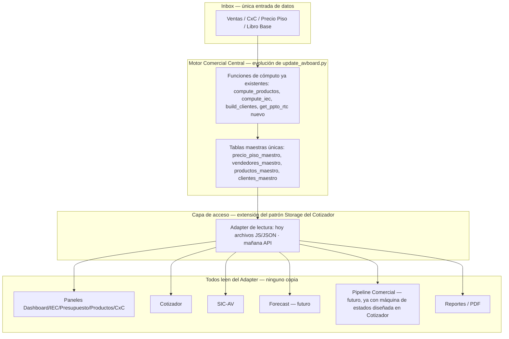

# SIC-AV — Estrategia de Implementación
**Grupo AV LATAM · Fase 2 — Análisis de integración con AV LATAM Board, como CTO/Product Owner**

Versión: 1.0 · Fecha: 2026-07-12 · Autor: Claude (Anthropic), modo Cowork
Estado: **ANÁLISIS ESTRATÉGICO — NO IMPLEMENTADO.** No se programó nada, no se modificó ningún archivo del Board, no se hizo ningún commit. Este documento es la hoja de ruta que se ejecutará en fases posteriores, cada una sujeta a aprobación previa.

Insumos usados para este análisis (releídos y verificados hoy, no asumidos de memoria): `ARQUITECTURA_ACTUAL_AV_LATAM_BOARD.md`, `SIC_AV_MASTER_ARCHITECTURE.md`, `docs/AVBOARD_MASTER_ARCHITECTURE.md`, `docs/AVBOARD_BUSINESS_RULES.md`, `docs/AVBOARD_UPDATE_PROTOCOL.md`, código real de `scripts/update_avboard.py`, `scripts/ppto_libro_base.py`, `apps/cotizador/cotizador_core.js`, `apps/cotizador/README.md` y `apps/cotizador/data/modelo/modelo_centro_comercial.json`. Donde una afirmación no pudo verificarse en código, se marca `[NO DETERMINABLE]`.

---

## Resumen para Javier (léase primero)

Si este fuera mi proyecto, no construiría el SIC-AV como un sistema nuevo que aprende a hablar con el Board desde afuera. Lo construiría como la primera extensión real de un patrón que ya existe en el proyecto pero que nadie terminó de conectar: el patrón *adapter* de `apps/cotizador/cotizador_core.js` (hoy usado solo para guardar cotizaciones en `localStorage`) y el modelo de datos ya diseñado — aunque no conectado — en `apps/cotizador/data/modelo/` (5 schemas: clientes, productos, cotizaciones, detalle de cotización, configuración, con fecha de diseño 2026-07-01, es decir, hace 11 días).

Eso significa que la pieza más crítica de esta fase — un **Motor Comercial Central** — no es una idea nueva que hay que inventar desde cero: es la evolución natural de dos cosas que ya existen en el repo, hoy desconectadas entre sí: (a) las funciones de cálculo ya maduras de `scripts/update_avboard.py` (`compute_productos()`, `compute_iec_chile()`, `load_piso_chile()`, etc.), y (b) el patrón de `Storage`/adapter del Cotizador, que ya fue diseñado explícitamente para que "cambiar el adapter no requiera tocar" ninguna pantalla (`apps/cotizador/README.md`, sección 6). El SIC-AV es el primer consumidor real que justifica terminar de construir ese motor — no un proyecto que compite con él.

También encontré, revisando el código de presupuesto, algo que cambia una recomendación que hice ayer en la Fase 1: `scripts/ppto_libro_base.py` (`_read_total_row()`, línea 170) **ya sabe leer la hoja "Presupuesto Pais" del Libro Base, pero deliberadamente salta las filas de detalle por RTC (filas 2-8 Chile, 14-20 Perú) y solo toma la fila TOTAL.** El presupuesto por vendedor sigue viviendo hardcodeado en `PPTO_RTC_CL`/`PPTO_RTC_ANUAL_PE` dentro de `scripts/update_avboard.py` (líneas 107 y 115) **a pesar de que el dato real ya está en el mismo Excel, en la misma hoja, a dos filas de distancia de lo que sí se lee hoy.** Esto es una victoria rápida de bajo riesgo y alto impacto — no un problema de datos faltantes, sino de una función que no termina de leer lo que ya tiene enfrente. La detallo en la sección 9.

---

## 1. Qué componentes actuales reutilizaría

| Componente | Por qué se reutiliza tal cual (o casi) |
|---|---|
| `avboard_data.js` (capa de ventas/CxC/productos consolidados) | Es, hoy, la fuente más confiable de la plataforma para 14 de 19 paneles. El SIC-AV debe leerlo, nunca copiarlo. |
| Motor IEC (`compute_iec_chile()`, tabla de Factor IEC en `docs/AVBOARD_BUSINESS_RULES.md` sección 2) | Es la pieza más madura de todo el sistema. La fórmula conceptual del SIC-AV (venta × factor IEC × ...) depende exactamente de este cálculo. Reutilizar, no reconstruir. |
| `compute_productos()` (línea 1079 de `update_avboard.py`) | Ya cruza venta con costo/piso y calcula margen por SKU — es la base del futuro cruce "producto × comisión". |
| `scripts/ppto_libro_base.py` (a nivel país) | Ya lee el Libro Base real, con fallback documentado. Extenderlo (sección 9) es mucho más barato que reemplazarlo. |
| Patrón `Storage`/adapter del Cotizador (`cotizador_core.js`, líneas 657-711) | Ya fue diseñado para que un cambio de fuente de datos (de `localStorage` a una API real) no obligue a tocar ninguna pantalla. Es exactamente el patrón que necesita el Motor Comercial Central para servir a Dashboard, IEC, Cotizador, SIC, Forecast y Pipeline sin que cada uno reimplemente su propia lectura de datos. |
| Los 5 schemas de `apps/cotizador/data/modelo/` (clientes, productos, cotizaciones, detalle de cotización, configuración) | Ya modelan relaciones que el SIC-AV necesita — incluida la relación `CLIENTES.rtc_asignado → (futuro) VENDEDORES.id`, marcada explícitamente como "no modelada todavía" en el propio manifest (`modelo_centro_comercial.json`, línea 42). El SIC-AV es la razón concreta para completar esa entidad VENDEDORES que el propio equipo ya anticipó necesitar. |
| El motor de generación de PDF del Cotizador (`PDF.vistaCliente()`, referenciado en `apps/cotizador/README.md`) | Reutilizable como base del Informe Ejecutivo del SIC-AV (ya lo señalaba `SIC_AV_MASTER_ARCHITECTURE.md`, sección 9). |
| Logs *append-only* (`update_log.txt`, `resumen_actualizacion.md`, `alertas.md`) | El SIC-AV debe escribir en el mismo sistema de trazabilidad, no crear uno paralelo. |
| Reglas de negocio ya aprobadas (`docs/AVBOARD_BUSINESS_RULES.md`): fórmula IEC, tabla de factor IEC, score de cliente, tramos CxC | Punto de partida documentado y con fecha de aprobación — no hay que re-derivar estas reglas desde cero, solo confirmar con Gerencia si aplican tal cual al cálculo de comisión monetaria (ver `SIC_AV_MASTER_ARCHITECTURE.md`, sección 16, decisión pendiente 2). |

---

## 2. Qué componentes modificaría

| Componente | Modificación necesaria | Por qué no se puede dejar igual |
|---|---|---|
| `scripts/ppto_libro_base.py` | Agregar `get_ppto_rtc()` que lea las filas 2-8 (Chile) y 14-20 (Perú) de la misma hoja "Presupuesto Pais", usando el mismo `month_map` que ya calcula `_load_presupuesto()` | Hoy descarta datos de vendedor que ya están en el Excel de origen (sección 9) |
| `scripts/update_avboard.py` | Eliminar `PPTO_RTC_CL`/`PPTO_RTC_ANUAL_PE` hardcodeados (líneas 107-118) y reemplazar por la llamada a `get_ppto_rtc()` | Es presupuesto por vendedor no auditable ni versionado — el riesgo #7 que la propia auditoría ya señaló |
| Precio piso (Chile y Perú) | Consolidar en una tabla maestra única (`precio_piso_maestro.json` o equivalente), tal como recomienda la auditoría (sección 6.8), leída — no copiada — por `avboard_data.js`, `Panel_IEC_Auditoria_2026.html` y el Cotizador | Hoy existen 3-4 copias no sincronizadas; es el prerrequisito más citado en toda esta cadena de documentos |
| Identificador de vendedor | Introducir un ID estable (ej. RUT/código interno), reemplazando gradualmente el uso de "apellido en minúscula" (Chile) y "nombre completo" (Perú) como clave de facto | Sin esto, ni el SIC-AV ni el CRM de Clientes pueden construir una relación confiable vendedor↔cliente↔comisión |
| `avboard_clientes.js → CLIENTES_PE` | Recalcular en cada corte (hoy `build_clientes()` lo preserva sin tocar, líneas 1631-1639) | El SIC-AV para Perú heredaría datos de cliente congelados desde antes de mayo si esto no se corrige primero |
| `extract_peru_cxc_static()` | Reemplazar por lectura real de un Excel de CxC Perú (el propio `docs/AVBOARD_MASTER_ARCHITECTURE.md` ya documentaba un archivo `AGROVECA CxC *.xlsx` que hoy no llega al inbox) | Congelado desde 10/05/2026 — bloquea por completo el Motor de Cobranza del SIC-AV para Perú |
| `Panel_Presupuesto_AV_2026.html` | Cerrar el `<script src>` sin cerrar (línea 18-146) que rompe los selectores de curva por RTC | No relacionado al SIC-AV directamente, pero si el Motor Comercial Central empieza a tocar este panel para wiring de presupuesto por vendedor, hay que arreglarlo en la misma pasada para no heredar el bug |

---

## 3. Qué componentes crearía desde cero

Solo donde de verdad no existe nada reutilizable:

1. **Entidad VENDEDORES con ID único** — hoy no existe en ningún lugar de la plataforma como entidad propia (ni en AV LATAM Board ni en el Cotizador); solo existe como texto libre. Es la única pieza de este análisis que es 100% nueva.
2. **Modelo de Cobro/Pago/Conciliación** (fecha de cobro real, pagos parciales, notas de crédito, devoluciones) — confirmado en la Fase 1 (`SIC_AV_MASTER_ARCHITECTURE.md`, sección 13) que no existe ningún campo equivalente hoy.
3. **Motor de Comisiones propiamente dicho** (los factores, la fórmula, la trazabilidad de comisión por factura) — es, literalmente, el objetivo del proyecto; no hay nada parecido hoy en ningún archivo (auditoría, sección 8, hallazgo 16).
4. **Portal del Vendedor y Portal Administrativo** (pantallas nuevas) — aunque reutilizarán componentes visuales y de acceso ya existentes (guard de sesión, Chart.js, patrones de tabla de los paneles actuales).
5. **Capa de acceso individual por vendedor** — hoy el Board usa una única contraseña compartida para todos los roles (`docs/AVBOARD_MASTER_ARCHITECTURE.md`, sección 6); el SIC-AV necesita que cada vendedor vea solo su propia información, lo que requiere autenticación individual, inexistente hoy.

---

## 4. Qué información ya existe y podemos aprovechar

Ya cubierto en detalle en la sección 1, pero resumido por área temática:

- **Ventas:** agregada (alta confiabilidad) y transaccional con folio (media confiabilidad, depende de que `TX_CL`/`TX_PE` esté al corte).
- **Precio piso e IEC:** el componente más maduro de la plataforma — reutilizable casi sin cambios, salvo la unificación de fuente.
- **Presupuesto país:** confiable, ya deriva del Libro Base real.
- **Presupuesto RTC:** existe en el Excel de origen (recién confirmado, sección 9) — solo falta terminar de leerlo.
- **Clientes Chile:** recalculado cada corte, con score y recomendaciones ya documentadas.
- **Modelo de datos relacional (parcial):** ya diseñado en `apps/cotizador/data/modelo/`, con relaciones explícitas hacia una futura entidad Vendedor — ahorra trabajo de diseño de esquema para el SIC-AV.
- **Patrón de integración (adapter):** ya diseñado y documentado en el Cotizador, listo para extenderse a un Motor Comercial Central.
- **Motor de PDF:** ya existe para el Cotizador, reutilizable para el Informe Ejecutivo del SIC-AV.

## 5. Qué información falta realmente

Sin cambios respecto a lo ya identificado en `SIC_AV_MASTER_ARCHITECTURE.md` (sección 13), confirmado hoy contra el código real, con una precisión nueva sobre presupuesto:

- Fecha de cobro real por factura, monto cobrado por línea, pagos parciales, notas de crédito, devoluciones — **no existe nada de esto en ningún archivo**, es la brecha más crítica y no tiene atajo conocido: hay que construirlo desde el proceso de Finanzas hacia adentro.
- ID único y estable de vendedor — no existe, pero el propio modelo del Cotizador ya anticipó la necesidad (`modelo_centro_comercial.json`, relación 4).
- Cargo (RTC/KAM/Jefe de Ventas) como atributo de dato — no existe, solo como agrupador de paneles.
- CxC Perú vivo — no existe, congelado desde 10/05/2026.
- Presupuesto RTC real (matiz nuevo): **no falta el dato — falta la función que lo lea.** Está en el Excel del Libro Base, filas 2-8 (Chile) y 14-20 (Perú), simplemente `_read_total_row()` las salta a propósito para llegar a la fila TOTAL. Esto baja la prioridad de esta brecha de "Alta, requiere nueva fuente" a "Media, requiere una función nueva de ~30 líneas sobre un archivo que ya se lee".

## 6. Qué módulos podrían romperse si intervenimos incorrectamente

| Módulo en riesgo | Cómo se rompe | Mitigación |
|---|---|---|
| Los 14 paneles que leen `avboard_data.js` | Si el Motor Comercial Central cambia la forma de `avboard_data.js` (por ejemplo, para agregar folio/vendedor_id) sin mantener retrocompatibilidad de campos existentes | Extender el esquema (agregar campos), nunca renombrar ni eliminar campos que los paneles ya leen; regresión completa de los 19 HTML antes de cualquier cambio (mismo método jsdom ya usado en la auditoría de wiring de junio) |
| `Panel_IEC_Auditoria_2026.html` (TX_CL/TX_PE) | Si se migra el precio piso a una tabla maestra y el script de inyección por regex (Tipo B del protocolo) no se actualiza en el mismo commit | Actualizar `docs/AVBOARD_UPDATE_PROTOCOL.md` Tipo B en la misma intervención que se toque la fuente de precio piso |
| Cotizador (`apps/cotizador/`) | Si se conecta el catálogo de precios a la tabla maestra pero se rompe el contrato de `Storage.list()`/`Calc.calcularLinea()` que ya usan `cotizador_chile.html`/`cotizador_peru.html` | Cualquier cambio debe pasar por el adapter, nunca modificar directamente los JSON que hoy consumen las pantallas sin verificar el shape esperado |
| `Panel_Presupuesto_AV_2026.html` | Al tocar la lectura de presupuesto RTC para conectarla a `get_ppto_rtc()`, se puede exponer el bug ya conocido del `<script src>` sin cerrar (líneas 18-146) si no se corrige en la misma pasada | Corregir el cierre de la etiqueta como parte del mismo cambio, con validación visual de los selectores de curva por RTC antes y después |
| `avboard_clientes.js` | Si se activa el recálculo de `CLIENTES_PE` (hoy congelado) sin verificar primero contra qué Excel de Perú se recalculará | Confirmar fuente y hacer un corte de prueba en paralelo antes de reemplazar el comportamiento actual |

## 7. Qué dependencias existen

```
Excel /inbox (ventas, CxC, precio piso, Libro Base)
   → scripts/update_avboard.py (compute_*, render_avboard_data_js)
        → avboard_data.js, avboard_clientes.js
             → 14 paneles HTML + Panel_Clientes
   → Panel_IEC_Auditoria_2026.html (TX_CL/TX_PE) — actualización manual paralela, Tipo A/B del protocolo
   → apps/cotizador/data/*.json — sin actualización automática hoy
        → cotizador_core.js (Storage/adapter) → cotizador_chile.html / cotizador_peru.html
             → apps/cotizador/data/modelo/*.schema.json — modelo relacional documentado, sin conectar

scripts/ppto_libro_base.py (get_ppto_all, país) ← independiente del flujo anterior, importado por update_avboard.py
   PPTO_RTC_CL / PPTO_RTC_ANUAL_PE (hardcoded) ← debería depender del mismo Excel que get_ppto_all(), hoy no lo hace
```

**Dependencia crítica para el Motor Comercial Central:** cualquier motor nuevo debe insertarse *entre* el pipeline (`update_avboard.py`) y los archivos de salida (`avboard_data.js`, `avboard_clientes.js`, catálogos del Cotizador) — no al lado de ellos. Insertarlo al lado es exactamente cómo se generaron las copias duplicadas de precio piso que hoy hay que deshacer.

## 8. Qué riesgos técnicos observo

1. **Riesgo de arquitectura de fondo:** todo el sistema (Board + Cotizador) es archivos estáticos sin base de datos ni backend. Un Motor Comercial Central real, con múltiples consumidores concurrentes (Dashboard, IEC, Cotizador, SIC, Forecast, Pipeline, Reportes, PDF), empieza a forzar los límites de ese modelo — no es una falla de diseño hoy, pero sí un techo a monitorear (desarrollado en la sección "Visión ERP").
2. **Riesgo de doble mantenimiento durante la transición:** mientras el Motor Comercial Central no reemplace por completo las funciones de `update_avboard.py`, van a coexistir dos formas de generar el mismo dato (la vieja función y el motor nuevo) — exactamente el patrón que ya generó los problemas de precio piso duplicado. Cada migración de un dato al motor central debe eliminar la fuente vieja en el mismo commit, no dejarla "por si acaso".
3. **Riesgo de identidad de vendedor a mitad de camino:** introducir un ID único de vendedor sin migrar *todas* las referencias existentes (`avboard_data.js`, `avboard_clientes.js`, `Panel_IEC_Auditoria`, Cotizador) al mismo tiempo crea un período donde coexisten el ID viejo (apellido/nombre) y el nuevo — alto riesgo de discrepancias de roster como las ya documentadas en junio.
4. **Riesgo de seguridad ya señalado en el propio Cotizador:** el `README.md` (línea 352) advierte que, al ser 100% client-side, cualquier clave de API viaja expuesta en el tráfico del navegador. Si el Motor Comercial Central expone un backend real en fases futuras, este es el momento de resolverlo correctamente, no de heredarlo.
5. **Riesgo de alcance del ciclo 26→25:** ya señalado en `SIC_AV_MASTER_ARCHITECTURE.md` (sección 3) — ninguna fuente actual corta datos en esa ventana; construir el Motor Comercial Central asumiendo ese corte sin confirmarlo con Finanzas obligaría a rehacer el motor de agregación.

## 9. Qué mejoras recomendaría previamente al desarrollo del SIC

En orden de costo/beneficio, no de importancia teórica:

1. **Terminar de leer el Libro Base (bajo costo, alto impacto):** agregar `get_ppto_rtc()` a `scripts/ppto_libro_base.py` para leer las filas 2-8/14-20 que hoy `_read_total_row()` salta a propósito. Elimina de un solo golpe el hallazgo #7 de la auditoría (presupuesto RTC hardcodeado) sin tocar ningún dashboard.
2. **Tabla maestra única de precio piso:** ya recomendada por la propia auditoría (sección 6.8); es el prerrequisito compartido de mayor apalancamiento — beneficia al Board, al Cotizador y al SIC-AV a la vez.
3. **Definir y poblar la entidad VENDEDORES con ID estable**, reutilizando la relación ya anticipada en `modelo_centro_comercial.json`.
4. **Activar CxC Perú en vivo**, reemplazando `extract_peru_cxc_static()`.
5. **Recalcular `CLIENTES_PE` en cada corte**, en vez de preservarlo congelado.
6. **Cerrar el `<script src>` sin cerrar de `Panel_Presupuesto_AV_2026.html`** antes de que cualquier trabajo de presupuesto por vendedor toque ese panel.

Ninguna de estas seis mejoras requiere el Motor Comercial Central para ejecutarse — son pasos que se pueden hacer sobre el código actual, y que hacen mucho más barata la construcción posterior del motor porque reducen de 3-4 copias de datos a 1 en las áreas más críticas.

---

## Análisis: ¿conviene un Motor Comercial Central?

**Sí, es recomendable — con una salvedad importante: no es un componente nuevo que se construye desde cero, es la formalización de un patrón que ya existe parcialmente en dos lugares distintos del repo y que hoy no se hablan entre sí.**

**Lo que ya existe y apunta en esa dirección:**
- Las funciones de `scripts/update_avboard.py` (`compute_productos()`, `compute_iec_chile()`, `load_piso_chile()`, `build_clientes()`) son, de hecho, un motor de cálculo — solo que hoy escribe su resultado directamente como texto embebido en archivos `.js`, en vez de exponerlo como una capa de datos consultable por más de un consumidor.
- El patrón `Storage`/adapter del Cotizador (`cotizador_core.js`, líneas 657-711) ya resuelve exactamente el problema de "que un cambio en la fuente de datos no obligue a tocar cada pantalla" — es la mitad técnica del problema, ya resuelta, solo que aplicada hoy nada más que a cotizaciones guardadas en `localStorage`.
- El modelo de datos de `apps/cotizador/data/modelo/` ya anticipa consumidores futuros (CRM Clientes, Pipeline Comercial, Reportes Comerciales) leyendo de las mismas entidades — es, en esencia, el catálogo de "quién debería consumir el motor central" ya escrito hace 11 días.

**Propuesta concreta (arquitectura recomendada):**



**Por qué no construirlo como un sistema completamente nuevo y separado:** hacerlo significaría un quinto lugar donde vive el precio piso (hoy hay 3-4, auditoría sección 6.1) y un segundo lugar donde vive la lógica de IEC — exactamente el error que este documento existe para evitar. El motor debe absorber y reemplazar gradualmente las funciones de `update_avboard.py`, no coexistir con ellas indefinidamente.

**Condición de éxito:** cada vez que una función se "migra" al motor central, su versión anterior se elimina en el mismo cambio. Si en algún momento hay dos formas de calcular el mismo IEC o el mismo precio piso vigentes a la vez por más de una fase del roadmap, algo se está haciendo mal.

---

## Visión estratégica: ¿de Dashboard Comercial a ERP Comercial en 5-10 años?

La dirección es razonable, pero el techo técnico actual es real y hay que nombrarlo con honestidad: **toda la plataforma (Board + Cotizador) es hoy archivos estáticos sin base de datos ni backend** (auditoría, sección 9). Eso es perfectamente adecuado para el volumen y número de usuarios actuales, y el patrón adapter del Cotizador ya está diseñado con esta migración en mente ("Fase 1 (actual): 100% client-side... mañana: API", `cotizador_core.js` línea 657). Pero un ERP comercial real — con comisiones, forecast, pipeline, pedidos y facturación conviviendo — eventualmente necesita:

- Un almacenamiento real con transacciones (no archivos regenerados completos en cada corte).
- Autenticación individual por usuario (hoy es una única clave compartida, auditoría/`AVBOARD_MASTER_ARCHITECTURE.md` sección 6).
- Concurrencia — hoy, dos personas no pueden actualizar el sistema al mismo tiempo sin pisarse (todo el pipeline regenera archivos completos).

**Recomendación:** no migrar a una base de datos real todavía — sería una inversión prematura para el volumen actual. Pero sí diseñar cada pieza nueva (Motor Comercial Central, entidad Vendedores, tabla maestra de precio piso) **detrás del patrón adapter**, exactamente como ya lo hizo el Cotizador. Así, cuando llegue el momento de migrar a un backend real (probablemente entre el año 3 y 5 de este horizonte, cuando el número de vendedores, países o la necesidad de concurrencia lo justifique), el cambio se hace en la capa adapter — no reescribiendo cada pantalla ni cada script de cálculo. Esta es, en términos concretos, la respuesta a si las decisiones de hoy soportan los próximos 5-10 años: **sí, siempre que se respete la disciplina de "un solo dato, un solo dueño, leído a través de un adapter" en cada pieza nueva que se construya a partir de ahora.**

---

## Roadmap Realista

No teórico — ordenado para no rehacer trabajo, con las dos correcciones que encontré hoy revisando el código (presupuesto RTC ya existe en el Excel; el modelo relacional del Cotizador ya anticipa Vendedores) incorporadas al orden.

| # | Paso | Por qué va en este orden | Depende de |
|---|---|---|---|
| 1 | **Normalización de datos** — completar `get_ppto_rtc()` sobre el Libro Base (mejora #1, sección 9); confirmar y documentar el mapeo canónico producto_orig→producto/formato en un solo lugar (hoy disperso, auditoría sección 8 hallazgo 13) | Es la corrección más barata y de mayor apalancamiento; no requiere diseño nuevo, solo terminar de leer datos que ya existen | Nada — se puede iniciar hoy |
| 2 | **Fuente única de precio piso** — construir `precio_piso_maestro` y migrar Board + Panel_IEC + Cotizador a leerlo (nunca copiarlo) | Es el prerrequisito citado en los tres documentos de este proyecto (auditoría, Fase 1 del SIC-AV, este documento); desbloquea el Motor IEC del SIC-AV | Paso 1 (mismo patrón de disciplina de fuente única) |
| 3 | **ID único de vendedor** — crear la entidad VENDEDORES, poblarla con un identificador estable, y migrar TODAS las referencias existentes en el mismo ciclo de trabajo (no dejar el ID viejo y el nuevo conviviendo, riesgo #3 de la sección 8) | Bloquea tanto el Motor de Comisiones como el CRM de Clientes (la relación `CLIENTES.rtc_asignado→VENDEDORES.id` ya está anticipada en el modelo del Cotizador) | Ninguna estructural, pero conviene hacerlo junto con el paso 2 para minimizar ventanas de doble fuente |
| 4 | **Motor Comercial Central** — formalizar las funciones de `update_avboard.py` como motor de cómputo único, expuesto detrás de un adapter (extensión del patrón ya usado en el Cotizador) | Solo tiene sentido una vez que precio piso y vendedor ya son fuente única — construirlo antes significaría que el motor central hereda las mismas duplicidades que buscamos eliminar | Pasos 2 y 3 |
| 5 | **Modelo de Cobro/Pago/Conciliación** — fecha de cobro real, pagos parciales, notas de crédito, devoluciones; y activar CxC Perú en vivo (mejora #4, sección 9) | Es la brecha más profunda y la que requiere más coordinación con Finanzas — mejor abordarla con el motor central ya en pie, para no construir el modelo de cobro dos veces | Paso 4 |
| 6 | **SIC-AV — Motor de Comisiones** (Fases 2 en adelante del propio `SIC_AV_MASTER_ARCHITECTURE.md`) | Es el primer gran consumidor real del Motor Comercial Central; su construcción valida si el motor central quedó bien diseñado | Pasos 4 y 5 |
| 7 | **Portal del Vendedor (SIC-AV) + acceso individual por vendedor** | El acceso individual es un prerrequisito compartido con cualquier futuro Portal Comercial más amplio — conviene resolverlo una sola vez | Paso 6 |
| 8 | **Forecast** — hoy no existe ningún dato ni panel (auditoría, sección 2.6); se construye sobre el Motor Comercial Central, reutilizando presupuesto + venta real ya centralizados | Paso 4 (motor), aprovecha datos ya consolidados en pasos 1-2 | Paso 4 |
| 9 | **Pipeline Comercial** — el Cotizador ya tiene la máquina de estados diseñada (BORRADOR→EMITIDA→ENVIADA→APROBADA/RECHAZADA→CONVERTIDA_A_PEDIDO, `modelo_centro_comercial.json`); conectar el Cotizador al motor central habilita este módulo con trabajo incremental, no desde cero | Paso 4, y que el Cotizador ya lea del motor central (no de sus JSON estáticos) | Paso 4 |
| 10 | **Portal Comercial ampliado, PDF ejecutivo unificado y Reportes** — informe del SIC-AV reutilizando el motor de PDF del Cotizador; reportes agregados reutilizando `Storage.list(pais, filtros)` ya existente | Es la capa de presentación final, se beneficia de tener todo lo anterior ya centralizado | Pasos 6-9 |
| 11 | **Evaluación de backend/base de datos real** — solo si el volumen de usuarios/concurrencia lo justifica (ver "Visión estratégica" arriba); migración detrás del adapter, sin reescribir pantallas | Es una decisión de negocio, no técnica — se evalúa, no se ejecuta automáticamente | Todo lo anterior, y crecimiento real del uso del sistema |

**Nota de disciplina para todo el roadmap:** en cada paso, la fuente vieja del dato que se está centralizando se elimina en el mismo commit en que se activa la fuente nueva. Ese es, en una frase, el error que este documento existe para que no se repita.

---

*Documento generado por Claude (Anthropic) · Modo Cowork · Fase 2 — Estrategia de integración, sin implementación · Agroveca AV LATAM · 2026-07-12*
