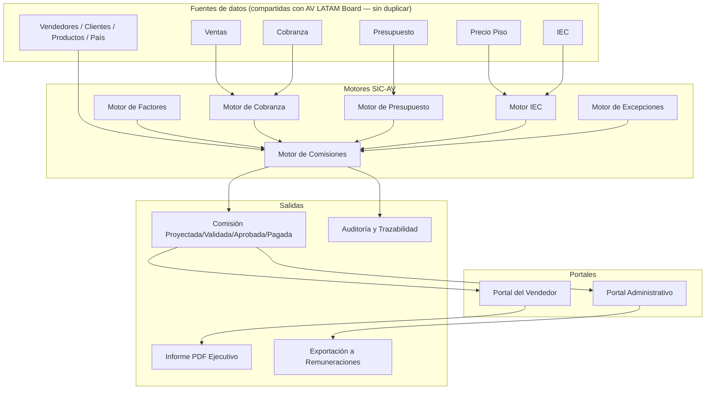
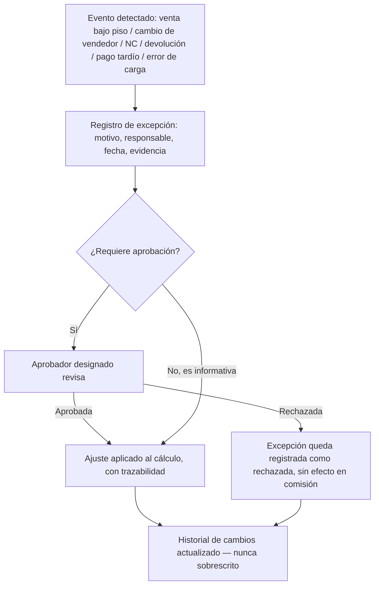

# SIC-AV — Sistema Integral de Incentivos Comerciales
**Grupo AV LATAM · Arquitectura Funcional y Técnica — Fase 1 (Diseño)**

Versión: 1.0 (borrador para aprobación) · Fecha: 2026-07-12 · Autor: Claude (Anthropic), modo Cowork
Estado: **DISEÑO — NO IMPLEMENTADO.** Ningún código fue escrito, ningún dashboard fue modificado, ningún dato fue conectado. Este documento es exclusivamente arquitectura funcional y técnica para revisión y aprobación previa a Fase 2.

Documento de referencia auditado: `ARQUITECTURA_ACTUAL_AV_LATAM_BOARD.md` (auditoría técnica de AV LATAM Board, 2026-07-12, la misma fecha de este diseño). Todo dato citado sobre "lo que existe hoy" proviene de esa auditoría; no se inventó ninguna cifra ni comportamiento.

---

## Cómo leer este documento

- **Estado actual** — lo que existe hoy en AV LATAM Board, verificado en la auditoría de referencia.
- **Arquitectura propuesta** — el diseño del SIC-AV, aún no construido ni aprobado.
- **Requerimiento** — algo que el sistema deberá cumplir una vez implementado.
- **Decisión pendiente** — algo que requiere aprobación explícita de Gerencia General, Finanzas, RR.HH. o Directorio antes de poder programarse.
- **Riesgo** — algo que puede salir mal si se avanza sin resolver el punto señalado.

Ningún porcentaje, tabla de factores o fórmula de esta arquitectura debe interpretarse como definitivo. Todos están marcados explícitamente como "configurable, sin aprobar".

---

## 1. Objetivo del Proyecto

El SIC-AV es el sistema que permitirá a cada vendedor, RTC, KAM o Jefe de Ventas de Grupo AV LATAM (Chile y Perú):

Revisar diariamente su comisión proyectada y su comisión validada; entender cómo se construyó cada una; consultar el detalle por factura, cliente, producto y cobro; visualizar qué factores aumentaron o redujeron su comisión; revisar su cumplimiento de presupuesto, su edad de cartera y su IEC; consultar sus ventas pendientes de cobro; simular cuánto podría ganar; y descargar un informe PDF ejecutivo de su ciclo comercial.

El sistema debe operar igual para Chile y para Perú, respetando que hoy ambos países tienen niveles de madurez de datos distintos (ver sección 13).

**Relación con AV LATAM Board:** el SIC-AV no reemplaza ni duplica AV LATAM Board. Se apoya en la misma información — ventas, cobranza, presupuesto, precio piso, IEC — pero añade la capa de cálculo y trazabilidad de comisión que hoy no existe en ningún lugar de la plataforma (auditoría, sección 8, hallazgo 16 y sección 10). En esta fase, el SIC-AV **no se conecta** al Board; el diseño contempla la integración como Fase 6 (sección 14).

---

## 2. Filosofía del Sistema

El SIC-AV no es una calculadora de pago. Es una herramienta de gestión. Diez principios rectores, ninguno de los cuales fija todavía un valor numérico:

1. Un vendedor debe poder construir el ingreso que desea alcanzar a partir de una gestión medible — el Simulador de Ingresos (sección 7.7) existe para esto.
2. La comisión debe motivar más venta y mejor calidad de venta, no operar principalmente como castigo.
3. Una venta termina cuando se cobra, no cuando se factura. Esto es una decisión de diseño con implicancia directa en datos: hoy el sistema no distingue "facturado" de "cobrado" a nivel de línea (auditoría, sección 10) — es la brecha más crítica de todo este proyecto.
4. No basta con vender; hay que vender bien — de ahí que el Factor IEC (disciplina de precio piso) sea un componente estructural de la fórmula, no un adorno.
5. El cumplimiento de presupuesto es la base del compromiso comercial.
6. El comercial ideal es Hunter y Farmer a la vez: capta clientes nuevos y cuida la cartera existente.
7. El sistema valora eficiencia, frecuencia, cobertura, calidad de cartera y disciplina de precios — no solo volumen.
8. El cálculo debe ser transparente, objetivo, predecible y auditable — cualquier comisión debe poder reconstruirse línea por línea (sección 10).
9. Cada vendedor debe poder entender su comisión sin depender de Finanzas, RR.HH. o su jefe — de ahí el Portal del Vendedor (sección 7).
10. Debe existir una sola fuente de verdad por dato — el mismo principio que la auditoría de AV LATAM Board ya identificó como la falla estructural más importante de la plataforma actual (auditoría, secciones 5, 6.8 y 11).

---

## 3. Ciclo Comercial

**Arquitectura propuesta.** Ciclo oficial: **del día 26 de un mes al día 25 del mes siguiente.** Ejemplo — ciclo de julio: 26 de junio al 25 de julio.

El modelo de datos de Ciclo (sección 12) debe registrar, para cada ciclo y cada vendedor:

| Campo | Propósito |
|---|---|
| Fecha de inicio del ciclo | 26 del mes anterior |
| Fecha de cierre | 25 del mes en curso |
| Estado del ciclo | abierto / en actualización / pre-cierre / validado / aprobado / pagado / cerrado / reabierto |
| Comisión proyectada | estimación en tiempo real mientras el ciclo está abierto |
| Comisión validada | congelada tras el paso de validación de datos |
| Comisión aprobada | congelada tras aprobación formal (ver Portal Administrativo, sección 8) |
| Comisión pagada | monto efectivamente liquidado |
| Fecha de validación / aprobación / pago | trazabilidad temporal de cada hito |

**Requerimiento:** el sistema debe soportar histórico completo de ciclos (no solo el vigente) y permitir correcciones posteriores sin borrar el estado anterior — cada corrección es un nuevo registro de auditoría, nunca una sobreescritura (mismo principio *append-only* que ya rige los logs de AV LATAM Board — auditoría, sección 7).

**Decisión pendiente:** el ciclo 26→25 es una fecha de corte distinta al mes calendario que usa hoy AV LATAM Board (mensual/YTD puro, auditoría sección 10, última fila de la tabla). Gerencia General y Finanzas deben confirmar si todos los datos fuente (ventas, cobranza, presupuesto) pueden re-cortarse a esta ventana, o si el SIC-AV debe prorratear datos mensuales para aproximar el ciclo 26→25 mientras las fuentes no se adapten.

---

## 4. Fuentes de Datos

**Regla de diseño no negociable:** el SIC-AV no tendrá base de datos propia ni fuente de datos paralela. Reutiliza lo que ya produce AV LATAM Board. Esto replica exactamente el principio de "fuente única de verdad" que la propia auditoría de AV LATAM Board recomienda adoptar internamente (auditoría, sección 11, recomendación 1).

### 4.1 Datos que existen hoy y pueden reutilizarse directamente

| Dato | Fuente actual | Confiabilidad |
|---|---|---|
| Venta facturada (agregada) | `avboard_data.js → chile_ventas / peru_ventas` | Alta a nivel país/mes |
| Venta facturada (por línea) | `TX_CL` / `TX_PE` en `Panel_IEC_Auditoria_2026.html` | Media — depende de que el TX esté al corte vigente |
| Precio piso | `avboard_data.js → productos[].piso` | Media — coexisten 3-4 copias no sincronizadas (auditoría, sección 6) |
| IEC | `avboard_data.js`, `avboard_clientes.js`, `Panel_IEC_Auditoria_2026.html` | Alta — el dato más maduro de la plataforma |
| Vendedores (identificador informal) | claves usadas en `chile_ventas.rtc_mensual_real`; nombre completo en Perú | Media — sin ID estable, con discrepancias de roster ya documentadas |
| Clientes | `avboard_clientes.js → CLIENTES_CL / CLIENTES_PE` | Alta para Chile; Perú congelado desde 10/05/2026 |
| Productos | `avboard_data.js → productos[]` | Alta, con 40 SKU no evaluables por falta de costo |
| País | Campo `pais` en todas las estructuras | Alta |
| Presupuesto (nivel país) | `scripts/ppto_libro_base.py` sobre el Libro Base | Alta |
| Presupuesto (nivel RTC/vendedor) | `PPTO_RTC_CL` / `PPTO_RTC_ANUAL_PE`, hardcodeado en Python | Baja — es anual, no mensual, y no deriva del Libro Base |
| Cobranza (CxC) Chile | `avboard_data.js → chile_cxc` | Alta |
| Cobranza (CxC) Perú | `extract_peru_cxc_static()` | Baja — congelado desde 10/05/2026, sin fuente Excel activa |

### 4.2 Datos que faltan por completo — prerrequisitos del SIC-AV

Ninguno de estos existe hoy en ningún archivo de AV LATAM Board (auditoría, sección 10):

- Número de factura o folio, propagado más allá de `Panel_IEC_Auditoria_2026.html`.
- Fecha de cobro real (hoy solo existe "días de mora", no la fecha del pago).
- Monto cobrado a nivel de línea (hoy solo existe saldo de CxC agregado por cliente).
- Pagos parciales / conciliación factura-por-factura.
- Notas de crédito.
- Devoluciones.
- ID único y estable de vendedor (hoy: apellido en minúscula para Chile, nombre completo para Perú — ninguno es estable ante homónimos o cambios de escritura).
- Cargo del vendedor (RTC / KAM / Jefe de Ventas) como campo de dato — hoy "Jefe de Ventas" existe solo como agrupador de paneles, no como atributo del vendedor.
- Presupuesto mensual por vendedor derivado del Libro Base (hoy es un valor anual hardcodeado en Python).
- Fecha efectiva de transferencia de cartera entre vendedores (no existe ningún concepto de historial de asignación cliente-vendedor).
- Tipo de cambio histórico por fecha de transacción (hoy existe un único TC de referencia fijo: 1 USD = 950 CLP, `avboard_data.js → meta.tc_clp_usd`).
- Estado de factura (emitida / cobrada / parcialmente cobrada / anulada / con nota de crédito).

**Ver matriz completa dato-por-dato en la sección 13.**

---

## 5. Arquitectura del Motor SIC-AV

Todos los motores descritos abajo son **diseño funcional**, no código. Ningún porcentaje, umbral o tabla mostrada es definitivo — todos están marcados explícitamente como configurables.

### A. Motor de Comisiones

**Responsabilidad:** calcular automáticamente la comisión de cada comercial.

**Recibe:** venta neta cobrada · porcentaje de comisión base · cumplimiento de presupuesto · edad de cartera · IEC · precio piso · bonificaciones · excepciones autorizadas.

**Devuelve:** comisión base · factor presupuesto · factor cartera · factor IEC · factor precio piso · bonificaciones · deducciones · comisión proyectada · comisión validada · comisión final · explicación del cálculo · detalle por factura.

**Requerimiento de diseño:** todos los porcentajes y umbrales deben vivir en tablas configurables (Motor de Factores, punto B) — nunca hardcodeados en código, replicando exactamente el antipatrón que la auditoría ya identificó como riesgo en AV LATAM Board (`PPTO_RTC_CL`, `PPTO_RTC_ANUAL_PE` hardcodeados en Python — auditoría, sección 8, hallazgo 7).

### B. Motor de Factores

Administra: factor de cumplimiento de presupuesto · factor de edad de cartera · factor IEC · tratamiento de precio piso · bonificaciones por sobrecumplimiento · campañas especiales · bonos por clientes nuevos · bonos por recuperación de clientes · bonos por productos/líneas estratégicas.

**Requerimiento:** configuración por país, por cargo, por vigencia; versionado; historial de cambios; fecha de inicio y término; responsable de aprobación; auditoría de quién modificó cada parámetro.

**Nota sobre el Factor IEC:** AV LATAM Board ya documenta una tabla de factor IEC aprobada el 2026-05-15 (`docs/AVBOARD_BUSINESS_RULES.md`, sección 2): IEC <70% → 20%, 70-84.9% → 70%, 85-91.9% → 80%, 92-94.9% → 90%, ≥95% → 105%. Esta tabla existe hoy como concepto documentado, pero **no está implementada como cálculo de comisión monetaria en ningún lugar del código** (auditoría, sección 8, hallazgo 16). El Motor de Factores del SIC-AV puede heredar esta tabla como punto de partida, pero su adopción formal para el cálculo de comisión real requiere confirmación explícita de Gerencia General — no debe asumirse vigente para SIC-AV solo porque está documentada para otro propósito (score de cliente / referencia comercial).

### C. Motor de Cobranza

Contempla: cobro total · cobro parcial · múltiples pagos sobre una factura · fecha real de cada pago · liberación proporcional de comisión · días transcurridos entre factura y cobro · reverso por devolución · reverso por nota de crédito · comisión pendiente / liberada / retenida.

**Riesgo de diseño:** este motor completo depende de datos que hoy no existen (sección 4.2). Es, junto con el ID estable de vendedor, el prerrequisito más bloqueante de todo el SIC-AV.

### D. Motor de Presupuesto

Contempla: presupuesto mensual por vendedor · por cargo · por país · cumplimiento individual y acumulado · sobrecumplimiento · vigencia · modificaciones autorizadas · forecast separado del presupuesto (AV LATAM Board hoy no tiene módulo de Forecast — auditoría, sección 2.6).

**Riesgo:** el presupuesto por vendedor hoy es anual y hardcodeado (sección 4.2) — este motor no puede operar con datos reales de cumplimiento individual mensual hasta que se resuelva esa brecha.

### E. Motor IEC

Reutiliza el IEC existente de AV LATAM Board (el componente más maduro de toda la plataforma), consumiendo una única fuente oficial. Muestra: IEC individual, por país, por ciclo, acumulado; venta sobre/bajo piso; venta no evaluable; facturas que impactaron el IEC; variación respecto del ciclo anterior.

**Riesgo heredado:** la propia auditoría advierte que el IEC transaccional (`Panel_IEC_Auditoria_2026.html`) y el IEC resumen (`avboard_data.js`) se actualizan en procesos y momentos distintos, sin garantía de sincronización (auditoría, sección 4, último ejemplo; sección 6.7). El SIC-AV debe leer de una única fuente IEC — a definir en Fase 1 de implementación (sección 14) cuál de las dos representaciones se convierte en la autoritativa, o si se construye la tabla maestra de precio piso que la propia auditoría recomienda (sección 6.8) como paso previo.

### F. Motor de Excepciones

Contempla: venta bajo precio piso autorizada · cambio de vendedor · cliente compartido · factura compartida · venta extraordinaria · pago posterior al cierre · nota de crédito posterior al pago de comisión · devolución · error de carga · cambio de presupuesto · ajuste manual autorizado · reapertura de ciclo cerrado.

**Requerimiento:** cada excepción registra motivo, responsable, fecha, evidencia, impacto, usuario que aprobó, historial de cambios — sin excepción a esta regla, ni siquiera para ajustes menores.

---

## 6. Fórmula Conceptual

```
Venta Neta Cobrada
  × Comisión Base
  × Factor de Cumplimiento de Presupuesto
  × Factor de Edad de Cartera
  × Factor IEC
  × Factor de Precio Piso (si corresponde)
  + Bonificaciones
  − Reversos o ajustes
  = Comisión Final
```

**Ningún valor de esta fórmula está fijado.** El motor debe soportar tablas configurables de cada factor por: país · cargo · fecha de vigencia · canal · tipo de cliente · tipo de producto · campaña.

**Decisión pendiente crítica:** "Venta Neta Cobrada" es el primer término de la fórmula y depende enteramente del Motor de Cobranza (punto C), que a su vez depende de datos que hoy no existen (fecha de cobro, pagos parciales — sección 4.2). Gerencia General y Finanzas deben decidir si, mientras esos datos no estén disponibles, el sistema opera en un modo transicional sobre "venta neta facturada" (dato disponible hoy) con una advertencia explícita en cada pantalla de que no es el cálculo final previsto por la filosofía del sistema (principio 3, sección 2).

---

## 7. Portal del Vendedor

Diseño funcional de cada pantalla. Ninguna se ha construido.

### 7.1 Resumen
Ciclo vigente · comisión proyectada/validada/pendiente/pagada · cumplimiento de presupuesto · IEC · estado de cartera · ventas cobradas/pendientes · semáforo de desempeño · comparación con ciclo anterior.

### 7.2 Mi Comisión
Comisión base · factores aplicados · bonificaciones · deducciones · comisión final · explicación paso a paso (trazable hasta cada factura, sección 10).

### 7.3 Detalle por Factura
Columnas: factura · fecha · cliente · producto · país · vendedor · venta neta · monto cobrado · fecha de cobro · días de cartera · precio de venta · precio piso · IEC asociado · comisión base · factores · comisión final · estado · observaciones.

**Riesgo:** monto cobrado y fecha de cobro por línea no existen hoy (sección 4.2) — esta pantalla no puede mostrar datos reales hasta que se resuelva esa brecha; en el modo transicional mostraría solo venta facturada con la misma advertencia de la sección 6.

### 7.4 Mi Presupuesto
Presupuesto del ciclo · venta real · cumplimiento · proyección · diferencia · acumulado · histórico.

### 7.5 Mi Cartera
Facturas pendientes/vencidas · cobros parciales · días de cartera · impacto estimado en comisión · alertas.

### 7.6 Mi IEC
IEC del ciclo · histórico · facturas sobre/bajo piso/no evaluables · impacto estimado en comisión · recomendaciones (puede heredar la lógica de recomendaciones automáticas ya documentada en `docs/AVBOARD_BUSINESS_RULES.md`, sección 8, adaptándola al contexto de comisión).

### 7.7 Simulador de Ingresos
**Entrada del vendedor:** cuánto desea ganar · venta proyectada · nivel de cumplimiento · IEC esperado · plazo de cobro · facturas pendientes.
**Salida del sistema:** venta necesaria · cobranza necesaria · IEC requerido · cumplimiento requerido · comisión estimada · acciones necesarias.

### 7.8 Histórico
Comisión por ciclo · variación · promedio · mejor/peor ciclo · tendencia · comparación anual.

### 7.9 Descarga PDF
Genera el Informe Ejecutivo de Gestión Comercial (sección 9).

---

## 8. Portal Administrativo

Pantallas: configuración de parámetros (general, por país, por cargo) · tabla de factores · gestión de presupuestos · gestión y estado de ciclos · validación de datos · excepciones · aprobaciones · auditoría · historial de cambios · exportación para remuneraciones · reapertura de ciclos · control de versiones · gestión de usuarios y permisos.

### Roles y matriz de acceso (funcional, sujeta a aprobación de RR.HH./Gerencia)

| Rol | Ve | Hace |
|---|---|---|
| Vendedor | Su propio ciclo, comisión, cartera, IEC, presupuesto | Simula ingresos, descarga su PDF |
| RTC | Igual que Vendedor (es la misma figura operativa en Chile) | Igual que Vendedor |
| KAM | Su propia cartera de cuentas clave, comisión asociada | Igual que Vendedor; **requiere que "KAM" exista como cargo de dato — hoy no existe (sección 13)** |
| Jefe de Ventas | Resumen de su equipo/país, comparativo entre vendedores | Revisa, no aprueba comisión ajena por defecto (a confirmar con Gerencia) |
| Gerencia Comercial | Todo el país/grupo, tablas de factores, campañas | Configura factores y campañas, aprueba excepciones comerciales |
| Finanzas | Todo, con foco en cobranza y exportación de pago | Aprueba comisión final, exporta a remuneraciones, gestiona notas de crédito |
| RR.HH. | Cargos, roles, histórico de ingresos por persona | Gestiona usuarios/permisos, valida cargo/vigencia de cada vendedor |
| Gerencia General | Todo el sistema, panel ejecutivo consolidado | Aprueba política de factores, aprueba reapertura de ciclos cerrados |
| Directorio | Panel ejecutivo consolidado, solo lectura | Ninguna acción operativa |
| Administrador del sistema | Todo, incluida configuración técnica | Gestiona usuarios, permisos, versiones, logs de auditoría |

**Decisión pendiente:** esta matriz de "qué ve y qué hace cada rol" es una propuesta inicial. Gerencia General, Finanzas y RR.HH. deben validarla y ajustarla antes de Fase 3 (Portal del Vendedor) — en particular, quién tiene poder de aprobación final sobre comisión (¿Finanzas sola, o Finanzas + Gerencia Comercial en conjunto?) y quién puede reabrir un ciclo cerrado.

---

## 9. Informe PDF

**Título:** Informe Ejecutivo de Gestión Comercial.

**Contenido:** logo Grupo AV LATAM · nombre del comercial · cargo · país · ciclo · comisión proyectada/validada/pagada · cumplimiento · IEC · venta cobrada · estado de cartera · resumen ejecutivo · detalle por factura · factores aplicados · bonificaciones · ajustes · comparación con ciclo anterior · oportunidades de mejora · fecha de generación · código único del informe · firma o validación digital · leyenda de auditoría.

**Uso previsto:** descarga, impresión, revisión uno a uno, respaldo de remuneraciones, auditoría.

**Nota de reutilización técnica:** el módulo Cotizador de AV LATAM Board (`apps/cotizador/`) ya cuenta con un motor de generación de PDF para el cliente final (auditoría, sección 2.14 y sección 11, recomendación 9). El diseño del SIC-AV recomienda evaluar la reutilización de ese motor de renderizado para el Informe Ejecutivo, en lugar de construir uno nuevo desde cero — esto es una recomendación de eficiencia técnica para Fase 5, no una decisión tomada.

---

## 10. Trazabilidad y Auditoría

Todo cálculo debe poder reconstruirse. El sistema debe guardar: fuente de cada dato · archivo de origen · fecha de carga · fecha de procesamiento · regla utilizada · versión de la política · factor aplicado · usuario que modificó · usuario que aprobó · fecha de aprobación · ajustes manuales · motivo · evidencia.

**Principio no negociable:** ningún cambio sobrescribe silenciosamente la historia. Esto extiende al SIC-AV el mismo patrón *append-only* que ya rige `logs/update_log.txt`, `resumen_actualizacion.md` y `alertas.md` en AV LATAM Board (auditoría, sección 7) — la diferencia es que en el SIC-AV este principio aplica a nivel de cada cálculo de comisión individual, no solo a nivel de bitácora general.

**Riesgo heredado a resolver:** la auditoría encontró que AV LATAM Board ya tiene un mecanismo de auto-chequeo (`verificarIntegridad()` en `avboard_data.js`) que hoy solo emite una advertencia en consola del navegador, sin bloquear ni reportar de forma visible (auditoría, sección 11, recomendación 5). El SIC-AV, por la naturaleza financiera de lo que calcula, no puede replicar ese patrón silencioso — cualquier inconsistencia debe generar una alerta visible y bloquear la validación del ciclo hasta resolverse.

---

## 11. Diagramas

### 11.1 Arquitectura general del SIC-AV



### 11.2 Flujo de datos


### 11.3 Flujo de cierre del ciclo


### 11.4 Flujo de una factura


### 11.5 Flujo de excepciones



---

## 12. Modelo de Datos Propuesto

Para cada entidad: ID único, campos, relaciones, fuente, responsable, frecuencia de actualización, validaciones. Ninguna de estas tablas está implementada.

| Entidad | ID único | Campos clave | Relaciones | Fuente | Responsable | Frecuencia | Validación |
|---|---|---|---|---|---|---|---|
| Vendedor | ID estable nuevo (a definir — hoy no existe) | nombre, cargo, país, fecha ingreso | Cargo, País, Cliente (cartera) | RR.HH. + AV LATAM Board (roster) | RR.HH. | Baja (cambia poco) | Único activo por RUT/RUC |
| Cargo | Código (RTC/KAM/JEFE) | nombre, nivel jerárquico | Vendedor | Definición nueva del SIC-AV | Gerencia Comercial / RR.HH. | Baja | — |
| País | CL / PE | moneda, TC referencia | Vendedor, Ciclo | AV LATAM Board | Finanzas | Baja | — |
| Cliente | RUT/RUC (ya existe: `cl_{rut}` / `pe_{ruc}`) | nombre, vendedor asignado, segmento | Vendedor, Factura | `avboard_clientes.js` | Comercial | Por corte | — |
| Producto | (producto, formato) — hoy sin ID único | nombre canónico, formato, costo, piso | Factura (línea) | `avboard_data.js → productos[]` | Comercial/Finanzas | Por corte | Requiere catálogo maestro con ID (brecha, sección 13) |
| Factura | Folio (hoy solo existe en `Panel_IEC_Auditoria`) | fecha, cliente, vendedor, monto, estado | Cliente, Vendedor, Línea de factura, Cobro | Nueva fuente requerida | Finanzas | Por transacción | Folio único por país |
| Línea de factura | Folio + N° línea | producto, cantidad, precio venta, precio piso | Factura, Producto | Nueva fuente requerida | Finanzas | Por transacción | — |
| Cobro | ID nuevo | folio asociado, fecha, monto, tipo (total/parcial) | Factura | Nueva fuente requerida — no existe hoy | Finanzas | Por transacción | Suma de cobros ≤ monto factura |
| Pago parcial | ID nuevo, referencia a Cobro | monto, fecha, saldo remanente | Factura, Cobro | Nueva fuente requerida | Finanzas | Por transacción | — |
| Nota de crédito | ID nuevo | folio asociado, monto, motivo, fecha | Factura | Nueva fuente requerida — no existe hoy | Finanzas | Por evento | — |
| Devolución | ID nuevo | folio/línea asociado, motivo, fecha | Factura, Línea de factura | Nueva fuente requerida — no existe hoy | Comercial/Finanzas | Por evento | — |
| Presupuesto | ID (vendedor + ciclo) | monto mensual, vigencia | Vendedor, Ciclo | `ppto_libro_base.py` (país) — falta desagregación a vendedor | Finanzas | Mensual | Debe derivar del Libro Base, no ser fijo |
| IEC | ID (vendedor/cliente + ciclo) | pct, sp, bp, elegible | Vendedor, Cliente, Ciclo | `avboard_data.js` / `Panel_IEC_Auditoria` | Comercial | Por corte | Unificar fuente (auditoría, 6.8) |
| Precio piso | (país, producto, formato, vigente_desde) | precio, fuente | Producto | Excel `/inbox` — hoy 3-4 copias | Gerencia Comercial | Por cambio de política | Tabla única (auditoría, 6.8) — prerrequisito del SIC-AV |
| Ciclo | (país + AAAA-MM) | fecha inicio/cierre, estado | Vendedor, Comisión | Nuevo — definición SIC-AV | Finanzas | Mensual | Ver sección 3 |
| Comisión | ID (vendedor + ciclo) | proyectada, validada, aprobada, pagada | Vendedor, Ciclo, Factura | Motor de Comisiones | Finanzas | Por ciclo | Debe reconstruirse 100% desde el detalle |
| Factor | (tipo + país + cargo + vigencia) | valor, versión | Comisión | Motor de Factores | Gerencia Comercial | Por cambio de política | Versionado obligatorio |
| Bonificación | ID nuevo | tipo, monto/porcentaje, condición | Comisión, Vendedor | Motor de Factores | Gerencia Comercial | Por campaña | — |
| Excepción | ID nuevo | tipo, motivo, responsable, evidencia, impacto | Comisión, Factura, Vendedor | Motor de Excepciones | Variable (ver sección 5.F) | Por evento | Requiere aprobación registrada |
| Aprobación | ID nuevo | tipo (ciclo/excepción), aprobador, fecha | Ciclo, Excepción, Comisión | Portal Administrativo | Rol correspondiente (sección 8) | Por evento | — |
| Informe PDF | Código único | vendedor, ciclo, fecha generación | Vendedor, Ciclo, Comisión | Motor de PDF | Sistema | Por descarga | Código no reutilizable |
| Usuario | ID nuevo | nombre, rol, cargo, país, credenciales | Rol, Vendedor | RR.HH. / Administrador | Baja | Acceso individual (hoy AV LATAM Board usa clave compartida — auditoría, 11.10) |
| Rol | Código (uno de los 10 de sección 8) | permisos | Usuario | Definición SIC-AV | Administrador | Baja | — |
| Auditoría | ID nuevo, *append-only* | entidad afectada, usuario, acción, fecha, valor anterior/nuevo | Todas | Sistema (automático) | Administrador | Continua | Nunca editable ni eliminable |

---

## 13. Datos Disponibles y Brechas

Matriz basada exclusivamente en `ARQUITECTURA_ACTUAL_AV_LATAM_BOARD.md` (sección 10 de ese documento, más hallazgos de las secciones 5, 6 y 8). No se agregó ningún dato no verificado en esa auditoría.

| Dato requerido | ¿Existe hoy? | Fuente actual | Confiabilidad | Brecha | Acción necesaria | Prioridad | Dependencia | Responsable sugerido |
|---|---|---|---|---|---|---|---|---|
| Venta facturada | Parcial | `avboard_data.js` (agregada); `TX_CL/TX_PE` (línea) | Media-Alta | Falta ID de factura consistente en todos los niveles | Propagar folio a todos los niveles | Alta | Ninguna | Desarrollo + Finanzas |
| Venta cobrada | No existe | — | — | No hay campo que distinga facturado de cobrado | Crear modelo de Cobro (sección 12) | **Crítica** | Ninguna | Finanzas |
| Fecha de factura | Parcial | `TX_CL/TX_PE.fecha` | Media | Falta propagar a `avboard_data.js`/`avboard_clientes.js` | Extender pipeline | Alta | Ninguna | Desarrollo |
| Fecha de cobro | No existe | — | — | Solo existe "días de mora" agregado | Crear campo de fecha real de pago | **Crítica** | Modelo de Cobro | Finanzas |
| Días de cartera | Sí (Chile) | `avboard_clientes.js → cxc.max_mora` | Alta CL / Baja PE | Perú estático desde 10/05/2026 | Activar fuente Excel viva para Perú | Alta | Ninguna | Comercial Perú |
| Pago parcial | No existe | — | — | Modelo de CxC es saldo total, no conciliación por factura | Crear modelo de Pago Parcial | **Crítica** | Modelo de Cobro | Finanzas |
| Nota de crédito | No existe | — | — | Concepto ausente en toda la plataforma | Crear entidad Nota de Crédito | Alta | Ninguna | Finanzas |
| Devolución | No existe | — | — | Concepto ausente en toda la plataforma | Crear entidad Devolución | Alta | Ninguna | Comercial/Finanzas |
| Vendedor responsable | Sí | `avboard_data.js`, `avboard_clientes.js.vendedor`, `TX_CL/TX_PE.vendedor` | Media (roster con discrepancias conocidas) | Sin ID estable | Crear ID único de vendedor (ej. RUT/código interno) | **Crítica** | Ninguna | RR.HH. |
| Cargo (RTC/KAM/Jefe) | Parcial | Solo agrupador de paneles, no dato | Baja | KAM no existe como concepto; Jefe no es campo de vendedor | Modelar cargo como atributo de dato | Alta | ID de vendedor | RR.HH. + Gerencia Comercial |
| Presupuesto mensual por vendedor | Parcial | `PPTO_RTC_CL`/`PPTO_RTC_ANUAL_PE`, hardcodeado, anual | Baja | No deriva del Libro Base, no es mensual | Desagregar desde Libro Base | Alta | Ninguna | Finanzas |
| Precio piso vigente | Sí | Ver auditoría sección 6 (3-4 copias) | Media | Sin tabla única, sin `vigente_desde` explícito y auditable | Construir tabla maestra de precio piso (auditoría, 6.8) | **Crítica** — prerrequisito de todo cálculo auditable | Ninguna | Gerencia Comercial + Desarrollo |
| IEC del ciclo | Sí | `avboard_data.js`, `avboard_clientes.js`, `Panel_IEC_Auditoria` | Alta, con riesgo de desincronización temporal | Doble representación no siempre coincidente | Definir fuente única IEC para SIC-AV | Alta | Tabla maestra de precio piso | Comercial |
| País | Sí | Campo `pais` en todas las estructuras | Alta | Ninguna | — | — | — | — |
| Moneda / tipo de cambio | Parcial | `meta.tc_clp_usd = 950` (fijo) | Media | TC único fijo, no histórico por fecha de transacción | Evaluar si se requiere TC histórico para comisión | Media | Ninguna | Finanzas |
| Estado de la factura | No existe | — | — | No hay estado emitida/cobrada/parcial/anulada | Crear campo de estado | **Crítica** | Modelo de Factura/Cobro | Finanzas |
| Fecha de transferencia de cartera entre vendedores | No existe | — | — | No hay historial de asignación cliente-vendedor | Crear registro de transferencia de cartera | Media | ID de vendedor, ID de cliente | Comercial + RR.HH. |
| Comisión monetaria por factura | No existe | — | — | Solo existe el Factor IEC conceptual (tabla de multiplicador), sin cálculo en dinero | Es precisamente el objetivo del SIC-AV — no es una brecha de AV LATAM Board sino la razón de este proyecto | **Crítica** (es el proyecto mismo) | Todo lo anterior | Gerencia Comercial + Finanzas + Desarrollo |
| Ciclos de corte distintos al mensual | No determinable | — | — | No se encontró soporte para ciclos no mensuales | Confirmar si el ciclo 26→25 requiere adaptar fuentes | Alta | Definición de ciclo (sección 3) | Finanzas + Gerencia General |

---

## 14. Implementación por Fases

Ninguna fase está autorizada a comenzar hasta la aprobación formal de la fase anterior.

### Fase 0 — Definición y aprobación de la política
**Objetivo:** que Gerencia General, Finanzas, RR.HH. y Directorio aprueben la fórmula conceptual, los factores iniciales y el ciclo comercial.
**Entregables:** este documento aprobado, con anexo de valores de factores definidos.
**Dependencias:** ninguna.
**Riesgos:** si se avanza a Fase 1 sin esta aprobación, cualquier construcción posterior puede requerir rediseño.
**Criterios de aceptación:** firma/aprobación explícita de los cuatro cuerpos mencionados.
**Pruebas necesarias:** ninguna (fase de política, no técnica).

### Fase 1 — Modelo de datos y fuentes maestras
**Objetivo:** construir la tabla maestra de precio piso (auditoría, 6.8) y definir el ID único de vendedor, cargo y folio de factura propagado.
**Entregables:** especificación técnica de cada entidad de la sección 12, con las brechas críticas de la sección 13 resueltas o con plan de mitigación aprobado.
**Dependencias:** Fase 0.
**Riesgos:** esta es la fase de mayor riesgo de retraso, porque depende de que Finanzas/Comercial habiliten datos que hoy no existen en ningún Excel (fecha de cobro, pagos parciales, notas de crédito).
**Criterios de aceptación:** cada entidad de la sección 12 tiene una fuente real identificada, no solo un diseño en papel.
**Pruebas necesarias:** validación de esquema contra datos reales de un mes de prueba.

### Fase 2 — Motor de cálculo en ambiente de prueba
**Objetivo:** implementar los Motores A-F (sección 5) en un ambiente aislado, sin conexión a producción.
**Entregables:** motor funcional con datos de prueba, capaz de reconstruir un cálculo de comisión completo con trazabilidad.
**Dependencias:** Fase 1.
**Riesgos:** fórmulas configurables mal diseñadas obligarían a reescribir el motor en fases posteriores — de ahí la importancia de que la Fase 0 fije bien la arquitectura de factores, aunque no los valores finales.
**Criterios de aceptación:** el motor reproduce manualmente, para al menos 3 vendedores de prueba, el mismo resultado que un cálculo hecho a mano en Excel por Finanzas.
**Pruebas necesarias:** pruebas unitarias por factor, prueba de extremo a extremo por vendedor de prueba.

### Fase 3 — Portal del Vendedor
**Objetivo:** construir las 9 pantallas de la sección 7.
**Entregables:** portal funcional en ambiente de prueba, con datos reales de al menos un ciclo cerrado.
**Dependencias:** Fase 2.
**Riesgos:** exponer una pantalla con datos parciales (ej. "venta cobrada" aproximada por facturado, sección 6) sin la advertencia adecuada puede generar desconfianza del equipo comercial.
**Criterios de aceptación:** al menos 3 vendedores piloto validan que entienden su comisión sin ayuda externa.
**Pruebas necesarias:** pruebas de usabilidad con usuarios reales, no solo funcionales.

### Fase 4 — Portal Administrativo
**Objetivo:** construir las pantallas de la sección 8, incluida la gestión de roles.
**Entregables:** portal administrativo funcional con los 10 roles definidos.
**Dependencias:** Fase 3 (para reutilizar componentes de UI ya validados).
**Riesgos:** la matriz de roles de la sección 8 es una propuesta — si RR.HH./Gerencia la cambian tarde, puede requerir retrabajo de permisos.
**Criterios de aceptación:** cada rol de la matriz de sección 8 puede hacer exactamente lo que se le asignó, ni más ni menos, verificado por pruebas de control de acceso.
**Pruebas necesarias:** pruebas de control de acceso por rol (negativas y positivas).

### Fase 5 — PDF
**Objetivo:** construir el Informe Ejecutivo de Gestión Comercial (sección 9).
**Entregables:** generador de PDF funcional, evaluando reutilización del motor del Cotizador (sección 9).
**Dependencias:** Fase 3.
**Riesgos:** bajo, es la fase más autocontenida.
**Criterios de aceptación:** el PDF generado reconstruye exactamente lo mostrado en el Portal del Vendedor para el mismo ciclo.
**Pruebas necesarias:** comparación automática PDF vs. pantalla.

### Fase 6 — Integración con AV LATAM Board
**Objetivo:** conectar el SIC-AV a las fuentes reales de AV LATAM Board (hoy el diseño trabaja sobre datos de prueba/copia).
**Entregables:** pipeline de lectura (nunca de copia) desde `avboard_data.js`, `avboard_clientes.js` y la futura tabla maestra de precio piso.
**Dependencias:** Fases 1-5, y que la tabla maestra de precio piso (Fase 1) ya esté integrada al pipeline principal de AV LATAM Board — no solo al SIC-AV.
**Riesgos:** este es el punto donde existe mayor riesgo de romper AV LATAM Board si no se respeta la regla de "solo lectura" — ningún cambio de esta fase debe escribir de vuelta en `avboard_data.js` ni en ningún panel HTML existente.
**Criterios de aceptación:** AV LATAM Board sigue funcionando exactamente igual después de la integración, verificado con las mismas pruebas jsdom que ya se usan para auditar wiring de paneles.
**Pruebas necesarias:** regresión completa de los 19 paneles de AV LATAM Board antes y después de la integración.

### Fase 7 — Piloto con datos reales
**Objetivo:** correr un ciclo comercial completo (26→25) en paralelo al proceso actual de Finanzas, sin reemplazarlo todavía.
**Entregables:** informe de discrepancias entre el cálculo del SIC-AV y el cálculo manual/actual de Finanzas para ese ciclo.
**Dependencias:** Fase 6.
**Riesgos:** cualquier discrepancia no explicada debe bloquear el paso a producción.
**Criterios de aceptación:** cero discrepancias no explicadas entre el SIC-AV y el proceso actual, para el ciclo piloto completo.
**Pruebas necesarias:** conciliación línea por línea del ciclo piloto.

### Fase 8 — Producción
**Objetivo:** el SIC-AV reemplaza el proceso manual de cálculo de comisión.
**Entregables:** sistema en producción, con el proceso manual anterior formalmente descontinuado.
**Dependencias:** Fase 7 exitosa y aprobación de Gerencia General.
**Riesgos:** dependencia total del sistema — debe existir un procedimiento de contingencia documentado si el sistema falla en medio de un ciclo.
**Criterios de aceptación:** al menos un ciclo completo pagado exclusivamente con el SIC-AV, sin intervención manual paralela.
**Pruebas necesarias:** simulacro de contingencia (¿qué pasa si el sistema cae 3 días antes del cierre del ciclo?).

---

## 15. Restricciones (recordatorio de alcance de esta Fase 1)

No se programó nada. No se modificó ningún archivo existente de AV LATAM Board. No se generó ningún módulo. No se conectó el SIC-AV al Board. No se asumió que existen datos que la auditoría indica que faltan — cada brecha de la sección 13 está marcada explícitamente. No se duplicó ninguna fuente — el diseño reutiliza AV LATAM Board en todos los casos donde el dato ya existe. No se propuso ningún cálculo imposible de auditar — el principio de trazabilidad (sección 10) es transversal a todo el diseño. No se fijó ningún porcentaje final de factor o comisión. No se presentó como definitiva ninguna decisión que requiera validación de Gerencia General, Finanzas, RR.HH. o Directorio — todas están señaladas como "decisión pendiente" en el cuerpo del documento.

---

## 16. Síntesis para Aprobación

Este documento distingue en todo momento entre estado actual (verificado en la auditoría de AV LATAM Board), arquitectura propuesta (diseño nuevo, no construido), requerimientos (lo que el sistema deberá cumplir), decisiones pendientes (listadas explícitamente abajo), riesgos y recomendaciones.

### Cinco riesgos críticos

1. **La "venta neta cobrada" — el primer término de la fórmula conceptual — no se puede calcular hoy.** No existe en ningún archivo de AV LATAM Board un campo que distinga venta facturada de venta efectivamente cobrada a nivel de línea (sección 4.2, sección 13). Sin resolver esto, el SIC-AV solo puede operar sobre una aproximación (venta facturada), lo que contradice el principio 3 de la filosofía del sistema (sección 2).
2. **No existe un identificador único y estable de vendedor.** Hoy Chile usa apellido en minúscula y Perú usa nombre completo — ninguno resiste homónimos, cambios de escritura o rotación de personal sin romper silenciosamente las relaciones de datos (auditoría, sección 8, hallazgo 9). Cualquier cálculo de comisión atado a este identificador hereda ese riesgo.
3. **El precio piso vive hoy en 3-4 copias no sincronizadas** (Excel de origen, `avboard_data.js`, `Panel_IEC_Auditoria_2026.html`, catálogo del Cotizador). El Factor de Precio Piso de la fórmula conceptual (sección 6) no puede considerarse auditable mientras no exista la tabla maestra única que la propia auditoría de AV LATAM Board ya recomienda construir (sección 6.8) — este es un prerrequisito compartido entre ambos sistemas, no exclusivo del SIC-AV.
4. **Perú tiene menor madurez de datos que Chile en casi todas las dimensiones relevantes para comisión:** CxC estático desde 10/05/2026, clientes congelados (`CLIENTES_PE` no se recalcula), sin ID estable de vendedor. Un SIC-AV que trate a ambos países como simétricos sin resolver esto generaría comisiones de menor confiabilidad para Perú desde el primer ciclo.
5. **Riesgo de integración (Fase 6):** conectar el SIC-AV a AV LATAM Board es, por diseño de este proyecto, el punto de mayor exposición a romper dashboards que hoy funcionan. Las reglas críticas del proyecto (no romper dashboards, no alterar estructura visual, no eliminar información previa) deben regir con el mismo rigor en la Fase 6 que en cualquier otra intervención sobre el Board.

### Cinco decisiones pendientes de Gerencia General (y otros cuerpos según corresponda)

1. **Definición de "venta neta cobrada" en el modo transicional** (sección 6): ¿el SIC-AV puede operar temporalmente sobre venta facturada, con advertencia explícita, mientras se construye el dato de cobro real? Requiere acuerdo de Gerencia General y Finanzas.
2. **Adopción formal de la tabla de Factor IEC ya documentada** (20%/70%/80%/90%/105%, sección 5.B) como parte de la fórmula de comisión del SIC-AV, o definición de una tabla distinta — hoy esa tabla existe solo como referencia conceptual en las reglas de negocio de AV LATAM Board, no como cálculo de comisión aprobado.
3. **Validación de la matriz de roles y permisos del Portal Administrativo** (sección 8), en particular quién tiene poder de aprobación final sobre comisión y quién puede autorizar la reapertura de un ciclo cerrado — requiere acuerdo entre Gerencia Comercial, Finanzas y RR.HH.
4. **Confirmación del ciclo comercial 26→25** como corte oficial para todas las fuentes de datos involucradas (ventas, cobranza, presupuesto), incluyendo si es necesario prorratear datos que hoy solo existen en corte mensual calendario.
5. **Priorización de las brechas críticas de la sección 13** (venta cobrada, pagos parciales, notas de crédito, devoluciones, ID de vendedor, tabla maestra de precio piso): ¿cuáles se resuelven antes de Fase 1, y cuáles pueden diferirse a un modo transicional con advertencias visibles en el Portal del Vendedor?

### Datos que faltan para comenzar a programar

Fecha de cobro real por factura · monto cobrado por línea · pagos parciales/conciliación · notas de crédito · devoluciones · ID único y estable de vendedor · cargo (RTC/KAM/Jefe de Ventas) como atributo de dato · presupuesto mensual por vendedor derivado del Libro Base · estado de factura · tabla maestra única de precio piso · fecha efectiva de transferencia de cartera entre vendedores. Detalle completo con fuente, confiabilidad y responsable sugerido en la sección 13.

### Primera fase recomendada de ejecución

**Fase 0 — Definición y aprobación de la política**, seguida inmediatamente por **Fase 1 — Modelo de datos y fuentes maestras**, priorizando dentro de esa fase la construcción de la tabla maestra de precio piso (que beneficia a todo AV LATAM Board, no solo al SIC-AV) y la definición del ID único de vendedor — son las dos brechas que bloquean tanto el Motor de Comisiones como el Motor de Cobranza si no se resuelven primero.

---

*Documento generado por Claude (Anthropic) · Modo Cowork · Fase 1 — Diseño funcional, sin implementación · Agroveca Grupo LATAM · 2026-07-12*
